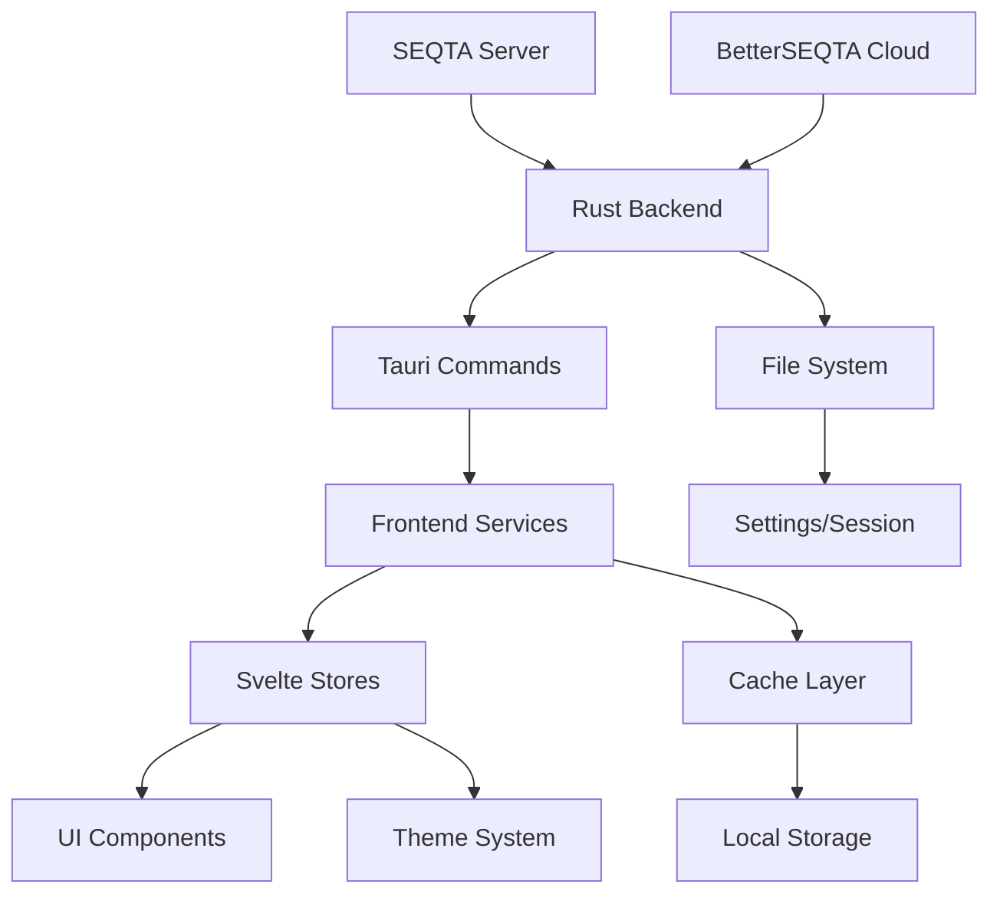
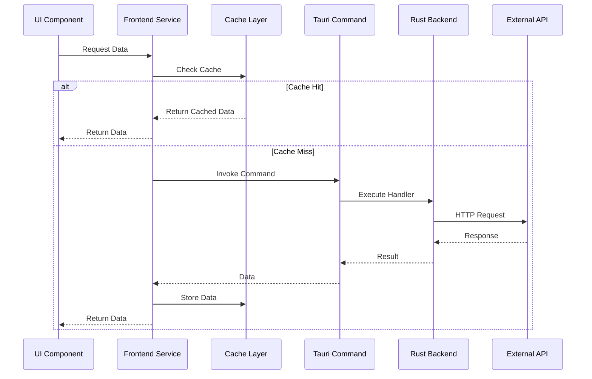

# Data Flow, Caching & State Management

This document provides a comprehensive overview of DesQTA's data flow architecture, caching strategies, and state management patterns, covering how data moves through the application from backend services to frontend components.

## 🏗 Data Flow Architecture

DesQTA implements a multi-layered data flow architecture that ensures efficient data management, caching, and state synchronization across the entire application.

### Architecture Overview



### Data Flow Layers

1. **External APIs** - SEQTA servers and BetterSEQTA Cloud
2. **Rust Backend** - Tauri-based native services
3. **Command Interface** - Tauri command bridge
4. **Service Layer** - Frontend business logic
5. **State Management** - Svelte stores and reactive state
6. **Caching Layer** - Multi-level caching system
7. **UI Components** - Reactive user interface

## 📊 State Management System

DesQTA uses Svelte's reactive state management with custom stores and services for complex state orchestration.

### Core State Architecture

#### Theme Store (`src/lib/stores/theme.ts`)

The theme store manages application-wide theming with reactive updates and persistence.

```typescript
import { writable, derived } from 'svelte/store';
import { invoke } from '@tauri-apps/api/core';
import { themeService, type ThemeManifest } from '../services/themeService';

// Core theme stores
export const accentColor = writable('#3b82f6');
export const theme = writable<'light' | 'dark' | 'system'>('system');
export const currentTheme = writable('default');
export const themeManifest = writable<ThemeManifest | null>(null);
export const customCSS = writable('');

// Derived store for theme properties
export const themeProperties = derived(
  [currentTheme, themeManifest],
  ([$currentTheme, $manifest]) => {
    if (!$manifest) return {};
    return $manifest.customProperties;
  }
);
```

#### State Update Flow

```typescript
// System theme detection
function getSystemTheme(): 'light' | 'dark' {
  if (typeof window !== 'undefined') {
    return window.matchMedia('(prefers-color-scheme: dark)').matches ? 'dark' : 'light';
  }
  return 'dark';
}

// DOM theme application
function applyTheme(themeValue: 'light' | 'dark' | 'system') {
  if (typeof document === 'undefined') return;

  const resolvedTheme = themeValue === 'system' ? getSystemTheme() : themeValue;

  // Apply CSS classes
  if (resolvedTheme === 'dark') {
    document.documentElement.classList.add('dark');
  } else {
    document.documentElement.classList.remove('dark');
  }

  // Set data attribute for compatibility
  document.documentElement.setAttribute('data-theme', resolvedTheme);
}

// Persistent theme updates
export async function updateTheme(newTheme: 'light' | 'dark' | 'system') {
  try {
    // Update backend settings
    const settings = await invoke<any>('get_settings');
    await invoke('save_settings', {
      newSettings: {
        ...settings,
        theme: newTheme,
      },
    });
    
    // Update store
    theme.set(newTheme);
    applyTheme(newTheme);

    // Set up system theme listener
    if (newTheme === 'system' && typeof window !== 'undefined') {
      const mediaQuery = window.matchMedia('(prefers-color-scheme: dark)');
      const handleSystemThemeChange = () => {
        theme.update((currentTheme) => {
          if (currentTheme === 'system') {
            applyTheme('system');
          }
          return currentTheme;
        });
      };

      mediaQuery.removeEventListener('change', handleSystemThemeChange);
      mediaQuery.addEventListener('change', handleSystemThemeChange);
    }
  } catch (e) {
    console.error('Failed to update theme:', e);
  }
}
```

#### Advanced Theme Loading

```typescript
export async function loadAndApplyTheme(themeName: string) {
  try {
    // Load theme files
    await themeService.loadTheme(themeName);
    currentTheme.set(themeName);

    const manifest = await themeService.getThemeManifest(themeName);
    themeManifest.set(manifest);

    if (themeName === 'default') {
      // Reset to default state
      accentColor.set('#3b82f6');
      let settings = await invoke<any>('get_settings');
      await invoke('save_settings', {
        newSettings: {
          ...settings,
          current_theme: 'default',
          accent_color: '#3b82f6',
          theme: 'dark',
        },
      });
      theme.set('dark');
      applyTheme('dark');
      return;
    }

    if (manifest) {
      // Apply theme-specific settings
      accentColor.set(manifest.settings.defaultAccentColor);
      
      // Save accent color
      let settings = await invoke<any>('get_settings');
      await invoke('save_settings', {
        newSettings: {
          ...settings,
          accent_color: manifest.settings.defaultAccentColor,
        },
      });

      // Apply theme mode
      theme.set(manifest.settings.defaultTheme);
      settings = await invoke<any>('get_settings');
      await invoke('save_settings', {
        newSettings: {
          ...settings,
          current_theme: themeName,
          theme: manifest.settings.defaultTheme,
        },
      });

      applyTheme(manifest.settings.defaultTheme);
    }
  } catch (error) {
    console.error('Failed to load and apply theme:', error);
  }
}
```

### Component State Patterns

#### Reactive State in Components

```svelte
<script lang="ts">
  import { theme, accentColor } from '$lib/stores/theme';
  import { derived } from 'svelte/store';

  // Derived reactive state
  const isDark = derived(theme, ($theme) => {
    if ($theme === 'system') {
      return window.matchMedia('(prefers-color-scheme: dark)').matches;
    }
    return $theme === 'dark';
  });

  // Local component state
  let loading = $state(false);
  let data = $state<any[]>([]);
  let error = $state<string | null>(null);

  // Reactive side effects
  $effect(() => {
    console.log('Theme changed:', $theme);
    // React to theme changes
  });

  // Async data loading with state management
  async function loadData() {
    loading = true;
    error = null;
    
    try {
      const response = await invoke<any[]>('get_data');
      data = response;
    } catch (e) {
      error = e instanceof Error ? e.message : 'Unknown error';
    } finally {
      loading = false;
    }
  }
</script>
```

#### State Persistence Patterns

```typescript
// Service-based state management
export class DataService {
  private static instance: DataService;
  private cache = new Map<string, any>();

  static getInstance(): DataService {
    if (!DataService.instance) {
      DataService.instance = new DataService();
    }
    return DataService.instance;
  }

  async getData(key: string, fetcher: () => Promise<any>): Promise<any> {
    // Check cache first
    if (this.cache.has(key)) {
      return this.cache.get(key);
    }

    // Fetch and cache
    const data = await fetcher();
    this.cache.set(key, data);
    return data;
  }

  invalidate(key: string): void {
    this.cache.delete(key);
  }

  clear(): void {
    this.cache.clear();
  }
}
```

## 🗄 Caching System Architecture

DesQTA implements a sophisticated multi-level caching system for optimal performance and offline capability.

### Cache Hierarchy

1. **Memory Cache** - In-memory storage for frequently accessed data
2. **Browser Storage** - localStorage/sessionStorage for persistence
3. **Service Worker Cache** - Network request caching
4. **Backend Cache** - Rust-based file system caching
5. **Database Cache** - Persistent structured data storage

### Frontend Cache Implementation

#### Core Cache Class

```typescript
interface CacheItem<T> {
  data: T;
  timestamp: number;  // Expiration timestamp
  size?: number;      // Memory usage tracking
}

class Cache {
  private static instance: Cache;
  private cache: Map<string, CacheItem<any>>;
  private defaultTTL: number = 5; // 5 minutes default
  private maxSize: number = 100 * 1024 * 1024; // 100MB
  private currentSize: number = 0;
  private accessOrder: string[] = []; // For LRU eviction

  // TTL presets in minutes
  static readonly TTL = {
    SHORT: 5,        // 5 minutes - API responses
    MEDIUM: 15,      // 15 minutes - User data
    LONG: 60,        // 1 hour - Static content
    VERY_LONG: 1440, // 24 hours - Configuration
  };

  private constructor() {
    this.cache = new Map();
    this.startCleanupInterval();
  }

  public static getInstance(): Cache {
    if (!Cache.instance) {
      Cache.instance = new Cache();
    }
    return Cache.instance;
  }

  public set<T>(key: string, data: T, ttlMinutes: number = this.defaultTTL): void {
    const serialized = JSON.stringify(data);
    const size = new Blob([serialized]).size;
    
    // Remove old entry if exists
    if (this.cache.has(key)) {
      this.delete(key);
    }
    
    // Evict items if necessary
    while (this.currentSize + size > this.maxSize && this.cache.size > 0) {
      this.evictLRU();
    }
    
    // Add new entry
    this.cache.set(key, {
      data,
      timestamp: Date.now() + ttlMinutes * 60 * 1000,
      size,
    });
    
    this.accessOrder.push(key);
    this.currentSize += size;
  }

  public get<T>(key: string): T | null {
    const item = this.cache.get(key);
    if (!item) return null;

    // Check expiration
    if (Date.now() > item.timestamp) {
      this.delete(key);
      return null;
    }

    // Update access order (LRU)
    this.updateAccessOrder(key);
    return item.data as T;
  }

  private evictLRU(): void {
    if (this.accessOrder.length === 0) return;
    
    const lruKey = this.accessOrder[0];
    this.delete(lruKey);
  }

  private updateAccessOrder(key: string): void {
    const index = this.accessOrder.indexOf(key);
    if (index > -1) {
      this.accessOrder.splice(index, 1);
    }
    this.accessOrder.push(key);
  }

  private delete(key: string): void {
    const item = this.cache.get(key);
    if (item) {
      this.cache.delete(key);
      this.currentSize -= item.size || 0;
      
      const index = this.accessOrder.indexOf(key);
      if (index > -1) {
        this.accessOrder.splice(index, 1);
      }
    }
  }

  private startCleanupInterval(): void {
    // Clean up expired items every 5 minutes
    setInterval(() => {
      const now = Date.now();
      for (const [key, item] of this.cache.entries()) {
        if (now > item.timestamp) {
          this.delete(key);
        }
      }
    }, 5 * 60 * 1000);
  }
}

export const cache = Cache.getInstance();
```

#### Cache Usage Patterns

```typescript
// API Response Caching
async function fetchUserData(userId: string): Promise<UserData> {
  const cacheKey = `user_${userId}`;
  const cached = cache.get<UserData>(cacheKey);
  
  if (cached) {
    return cached;
  }
  
  const userData = await invoke<UserData>('get_user_data', { userId });
  cache.set(cacheKey, userData, Cache.TTL.MEDIUM);
  return userData;
}

// Message Content Caching
async function getMessageContent(messageId: string): Promise<string> {
  const cacheKey = `message_${messageId}`;
  const cached = cache.get<string>(cacheKey);
  
  if (cached) {
    return cached;
  }
  
  const content = await seqtaFetch('/seqta/student/load/message', {
    method: 'POST',
    body: { action: 'message', id: messageId }
  });
  
  const data = JSON.parse(content);
  const messageBody = data.payload?.contents || '';
  
  // Cache for 24 hours
  cache.set(cacheKey, messageBody, Cache.TTL.VERY_LONG);
  return messageBody;
}

// Settings Caching
async function getSettings(): Promise<Settings> {
  const cacheKey = 'app_settings';
  const cached = cache.get<Settings>(cacheKey);
  
  if (cached) {
    return cached;
  }
  
  const settings = await invoke<Settings>('get_settings');
  cache.set(cacheKey, settings, Cache.TTL.LONG);
  return settings;
}
```

### Backend Caching (Rust)

#### Session-Based Caching

```rust
use std::collections::HashMap;
use std::sync::{Arc, Mutex};
use std::time::{Duration, Instant};

pub struct BackendCache {
    data: Arc<Mutex<HashMap<String, CacheEntry>>>,
    default_ttl: Duration,
}

struct CacheEntry {
    data: String,
    expires_at: Instant,
}

impl BackendCache {
    pub fn new(default_ttl: Duration) -> Self {
        Self {
            data: Arc::new(Mutex::new(HashMap::new())),
            default_ttl,
        }
    }

    pub fn get(&self, key: &str) -> Option<String> {
        let mut cache = self.data.lock().unwrap();
        
        if let Some(entry) = cache.get(key) {
            if Instant::now() < entry.expires_at {
                return Some(entry.data.clone());
            } else {
                // Remove expired entry
                cache.remove(key);
            }
        }
        
        None
    }

    pub fn set(&self, key: String, data: String, ttl: Option<Duration>) {
        let mut cache = self.data.lock().unwrap();
        let expires_at = Instant::now() + ttl.unwrap_or(self.default_ttl);
        
        cache.insert(key, CacheEntry {
            data,
            expires_at,
        });
    }

    pub fn invalidate(&self, key: &str) {
        let mut cache = self.data.lock().unwrap();
        cache.remove(key);
    }

    pub fn clear(&self) {
        let mut cache = self.data.lock().unwrap();
        cache.clear();
    }
}

// Global cache instance
lazy_static::lazy_static! {
    static ref GLOBAL_CACHE: BackendCache = BackendCache::new(Duration::from_secs(300)); // 5 minutes
}

// Usage in Tauri commands
#[tauri::command]
pub async fn get_cached_data(key: String) -> Result<Option<String>, String> {
    Ok(GLOBAL_CACHE.get(&key))
}

#[tauri::command]
pub async fn set_cached_data(key: String, data: String, ttl_seconds: Option<u64>) -> Result<(), String> {
    let ttl = ttl_seconds.map(Duration::from_secs);
    GLOBAL_CACHE.set(key, data, ttl);
    Ok(())
}
```

## 🔄 Data Flow Patterns

### Request-Response Flow



### State Update Flow

```typescript
// Component requests data update
async function updateUserSettings(newSettings: Settings) {
  try {
    // 1. Optimistic update (immediate UI feedback)
    settingsStore.set(newSettings);
    
    // 2. Persist to backend
    await invoke('save_settings', { newSettings });
    
    // 3. Update cache
    cache.set('app_settings', newSettings, Cache.TTL.LONG);
    
    // 4. Notify other components
    eventBus.emit('settings:updated', newSettings);
    
  } catch (error) {
    // 5. Rollback on error
    const previousSettings = await invoke<Settings>('get_settings');
    settingsStore.set(previousSettings);
    
    throw error;
  }
}
```

### Real-Time Data Flow

```typescript
// WebSocket-style real-time updates
class RealTimeDataService {
  private connections = new Map<string, any>();
  private subscribers = new Map<string, Set<(data: any) => void>>();

  subscribe(channel: string, callback: (data: any) => void): () => void {
    if (!this.subscribers.has(channel)) {
      this.subscribers.set(channel, new Set());
    }
    
    this.subscribers.get(channel)!.add(callback);
    
    // Return unsubscribe function
    return () => {
      this.subscribers.get(channel)?.delete(callback);
    };
  }

  broadcast(channel: string, data: any): void {
    const callbacks = this.subscribers.get(channel);
    if (callbacks) {
      callbacks.forEach(callback => {
        try {
          callback(data);
        } catch (error) {
          console.error('Error in real-time callback:', error);
        }
      });
    }
  }

  // Update cache and notify subscribers
  updateData(key: string, data: any): void {
    cache.set(key, data, Cache.TTL.SHORT);
    this.broadcast(key, data);
  }
}

const realTimeService = new RealTimeDataService();

// Usage in components
$effect(() => {
  const unsubscribe = realTimeService.subscribe('messages', (newMessage) => {
    messages = [...messages, newMessage];
  });
  
  return unsubscribe;
});
```

## 🔧 Service Layer Architecture

DesQTA implements a comprehensive service layer that abstracts business logic and provides consistent interfaces.

### Core Services

#### Authentication Service

```typescript
export interface UserInfo {
  clientIP: string;
  email: string;
  id: number;
  lastAccessedTime: number;
  meta: {
    code: string;
    governmentID: string;
  };
  personUUID: string;
  userName: string;
  displayName?: string;
  profilePicture?: string;
}

export const authService = {
  async checkSession(): Promise<boolean> {
    try {
      return await invoke<boolean>('check_session_exists');
    } catch (error) {
      console.error('Session check failed:', error);
      return false;
    }
  },

  async loadUserInfo(options?: { disableSchoolPicture?: boolean }): Promise<UserInfo | undefined> {
    try {
      // Check cache first
      if (options?.disableSchoolPicture) {
        cache.delete('userInfo');
      }
      
      const cachedUserInfo = cache.get<UserInfo>('userInfo');
      if (cachedUserInfo) {
        return cachedUserInfo;
      }

      // Fetch user data
      const res = await seqtaFetch('/seqta/student/login', {
        method: 'POST',
        headers: { 'Content-Type': 'application/json; charset=utf-8' },
        body: {},
      });

      const userInfo: UserInfo = JSON.parse(res).payload;

      // Handle profile picture
      if (!options?.disableSchoolPicture) {
        const profileImage = await seqtaFetch(`/seqta/student/photo/get`, {
          params: { uuid: userInfo.personUUID, format: 'low' },
          is_image: true,
        });
        userInfo.profilePicture = `data:image/png;base64,${profileImage}`;
      }

      // Cache user info
      cache.set('userInfo', userInfo, Cache.TTL.MEDIUM);
      return userInfo;
    } catch (e) {
      console.error('Failed to load user info:', e);
      return undefined;
    }
  },

  async logout(): Promise<boolean> {
    try {
      const success = await invoke<boolean>('logout');
      if (success) {
        // Clear all caches
        cache.clear();
        // Clear stores
        // Reset application state
      }
      return success;
    } catch (error) {
      console.error('Logout failed:', error);
      return false;
    }
  }
};
```

#### Error Service

```typescript
interface ErrorInfo {
  message: string;
  status: number;
  timestamp: Date;
  url?: string;
  userAgent?: string;
  userId?: string;
}

class ErrorService {
  private errorQueue: ErrorInfo[] = [];
  private isHandlingError = false;

  constructor() {
    this.setupGlobalErrorHandlers();
  }

  private setupGlobalErrorHandlers(): void {
    // Unhandled promise rejections
    window.addEventListener('unhandledrejection', (event) => {
      this.handleError(event.reason, 500, 'Unhandled Promise Rejection');
    });

    // JavaScript errors
    window.addEventListener('error', (event) => {
      this.handleError(event.error || event.message, 500, 'JavaScript Error');
    });
  }

  handleError(error: any, status: number = 500, context?: string): void {
    const errorInfo: ErrorInfo = {
      message: error instanceof Error ? error.message : String(error),
      status,
      timestamp: new Date(),
      url: window.location.href,
      userAgent: navigator.userAgent,
    };

    this.errorQueue.push(errorInfo);
    this.processErrorQueue();
  }

  handleManualError(message: string, status: number = 500): void {
    this.handleError(new Error(message), status, 'Manual Error');
  }

  private async processErrorQueue(): Promise<void> {
    if (this.isHandlingError || this.errorQueue.length === 0) {
      return;
    }

    this.isHandlingError = true;

    try {
      while (this.errorQueue.length > 0) {
        const error = this.errorQueue.shift()!;
        await this.reportError(error);
      }
    } catch (reportingError) {
      console.error('Failed to report error:', reportingError);
    } finally {
      this.isHandlingError = false;
    }
  }

  private async reportError(error: ErrorInfo): Promise<void> {
    try {
      // Log to console
      console.error('Error reported:', error);

      // Send to analytics (if enabled)
      await invoke('save_analytics', {
        data: JSON.stringify({
          type: 'error',
          ...error
        })
      });

      // Could also send to external error reporting service
    } catch (e) {
      console.error('Failed to report error:', e);
    }
  }
}

export const errorService = new ErrorService();
```

#### Weather Service

```typescript
export interface WeatherData {
  temperature: number;
  weathercode: number;
  location: string;
  country: string;
}

export const weatherService = {
  async getCurrentWeather(city: string, country: string): Promise<WeatherData | null> {
    const cacheKey = `weather_${city}_${country}`;
    
    // Check cache (15 minute TTL for weather data)
    const cached = cache.get<WeatherData>(cacheKey);
    if (cached) {
      return cached;
    }

    try {
      // Fetch from weather API
      const weatherData = await invoke<WeatherData>('get_weather_data', {
        city,
        country
      });

      // Cache the result
      cache.set(cacheKey, weatherData, Cache.TTL.MEDIUM);
      return weatherData;
    } catch (error) {
      console.error('Failed to fetch weather data:', error);
      return null;
    }
  },

  async getWeatherSettings(): Promise<{ enabled: boolean; city: string; country: string }> {
    const settings = await invoke<any>('get_settings');
    return {
      enabled: settings.weather_enabled || false,
      city: settings.weather_city || '',
      country: settings.weather_country || ''
    };
  }
};
```

### Service Integration Patterns

#### Service Composition

```typescript
// Composite service that uses multiple underlying services
class DashboardService {
  async loadDashboardData(): Promise<DashboardData> {
    const cacheKey = 'dashboard_data';
    const cached = cache.get<DashboardData>(cacheKey);
    
    if (cached) {
      return cached;
    }

    try {
      // Load data from multiple services in parallel
      const [userInfo, assessments, timetable, notices, weather] = await Promise.all([
        authService.loadUserInfo(),
        this.loadUpcomingAssessments(),
        this.loadTodaysTimetable(),
        this.loadRecentNotices(),
        this.loadWeatherData()
      ]);

      const dashboardData: DashboardData = {
        userInfo,
        assessments,
        timetable,
        notices,
        weather,
        lastUpdated: new Date()
      };

      // Cache for 5 minutes
      cache.set(cacheKey, dashboardData, Cache.TTL.SHORT);
      return dashboardData;
    } catch (error) {
      errorService.handleError(error, 500, 'Dashboard Load Failed');
      throw error;
    }
  }

  private async loadUpcomingAssessments(): Promise<Assessment[]> {
    // Implementation using caching and error handling
  }

  private async loadTodaysTimetable(): Promise<TimetableEntry[]> {
    // Implementation using caching and error handling
  }

  private async loadRecentNotices(): Promise<Notice[]> {
    // Implementation using caching and error handling
  }

  private async loadWeatherData(): Promise<WeatherData | null> {
    return weatherService.getCurrentWeather('Sydney', 'Australia');
  }
}
```

#### Service Middleware

```typescript
// Middleware for service calls
function withErrorHandling<T extends any[], R>(
  fn: (...args: T) => Promise<R>,
  errorMessage?: string,
  status: number = 500
) {
  return async (...args: T): Promise<R | null> => {
    try {
      return await fn(...args);
    } catch (error) {
      const message = errorMessage || (error instanceof Error ? error.message : 'An error occurred');
      errorService.handleManualError(message, status);
      return null;
    }
  };
}

function withCaching<T extends any[], R>(
  fn: (...args: T) => Promise<R>,
  keyGenerator: (...args: T) => string,
  ttl: number = Cache.TTL.MEDIUM
) {
  return async (...args: T): Promise<R> => {
    const cacheKey = keyGenerator(...args);
    const cached = cache.get<R>(cacheKey);
    
    if (cached) {
      return cached;
    }
    
    const result = await fn(...args);
    cache.set(cacheKey, result, ttl);
    return result;
  };
}

// Usage
const safeLoadUserData = withErrorHandling(
  withCaching(
    authService.loadUserInfo,
    () => 'user_info',
    Cache.TTL.MEDIUM
  ),
  'Failed to load user information'
);
```

## 🔄 Data Synchronization

### Frontend-Backend Sync

```typescript
class SyncService {
  private syncQueue: SyncOperation[] = [];
  private isOnline = navigator.onLine;

  constructor() {
    this.setupOnlineStatusListener();
    this.startSyncProcess();
  }

  private setupOnlineStatusListener(): void {
    window.addEventListener('online', () => {
      this.isOnline = true;
      this.processSyncQueue();
    });

    window.addEventListener('offline', () => {
      this.isOnline = false;
    });
  }

  async queueSync(operation: SyncOperation): Promise<void> {
    this.syncQueue.push(operation);
    
    if (this.isOnline) {
      await this.processSyncQueue();
    }
  }

  private async processSyncQueue(): Promise<void> {
    while (this.syncQueue.length > 0 && this.isOnline) {
      const operation = this.syncQueue.shift()!;
      
      try {
        await this.executeSync(operation);
      } catch (error) {
        // Re-queue failed operations
        this.syncQueue.unshift(operation);
        break;
      }
    }
  }

  private async executeSync(operation: SyncOperation): Promise<void> {
    switch (operation.type) {
      case 'settings':
        await invoke('save_settings', { newSettings: operation.data });
        break;
      case 'theme':
        await invoke('save_theme_settings', { theme: operation.data });
        break;
      // Add more sync operation types as needed
    }
  }

  private startSyncProcess(): void {
    // Process sync queue every 30 seconds
    setInterval(() => {
      if (this.isOnline && this.syncQueue.length > 0) {
        this.processSyncQueue();
      }
    }, 30000);
  }
}

interface SyncOperation {
  type: 'settings' | 'theme' | 'user_data';
  data: any;
  timestamp: Date;
  retryCount: number;
}
```

## 🎯 Performance Optimization

### Data Loading Strategies

```typescript
// Lazy loading with suspense-like pattern
async function loadComponentData<T>(
  loader: () => Promise<T>,
  fallback: T
): Promise<T> {
  try {
    return await loader();
  } catch (error) {
    console.error('Failed to load component data:', error);
    return fallback;
  }
}

// Progressive enhancement
class ProgressiveDataLoader {
  async loadEssentialData(): Promise<EssentialData> {
    // Load critical data first
    return await this.loadCriticalUserData();
  }

  async loadEnhancementData(): Promise<EnhancementData> {
    // Load nice-to-have data after essential data
    return await this.loadAdditionalFeatures();
  }

  async loadBackgroundData(): Promise<void> {
    // Load background data that doesn't affect initial render
    await this.preloadNextPageData();
  }
}

// Batch loading for efficiency
class BatchLoader {
  private pendingRequests = new Map<string, Promise<any>>();

  async load<T>(key: string, loader: () => Promise<T>): Promise<T> {
    if (this.pendingRequests.has(key)) {
      return this.pendingRequests.get(key)!;
    }

    const promise = loader();
    this.pendingRequests.set(key, promise);

    try {
      const result = await promise;
      return result;
    } finally {
      this.pendingRequests.delete(key);
    }
  }
}
```

## 🔮 Future Enhancements

### Planned Improvements

1. **GraphQL Integration**
   - Unified data fetching interface
   - Automatic caching and invalidation
   - Type-safe queries

2. **WebSocket Support**
   - Real-time data updates
   - Live collaboration features
   - Push notifications

3. **Offline-First Architecture**
   - Service worker integration
   - Background sync
   - Conflict resolution

4. **Advanced Caching**
   - Intelligent prefetching
   - Cache warming strategies
   - Memory usage optimization

### Implementation Roadmap

```typescript
// Future GraphQL integration
const client = new GraphQLClient({
  endpoint: 'https://api.desqta.com/graphql',
  cache: new InMemoryCache(),
  errorPolicy: 'all'
});

// Future WebSocket integration
const wsClient = new WebSocketClient({
  url: 'wss://api.desqta.com/ws',
  reconnect: true,
  heartbeat: 30000
});

// Future offline support
const offlineManager = new OfflineManager({
  storage: new IndexedDBStorage(),
  syncStrategy: 'last-write-wins',
  conflictResolver: customResolver
});
```

---

**Related Documentation:**
- [Frontend Architecture](../frontend/README.md) - Overall frontend structure
- [Backend Architecture](../backend/README.md) - Rust backend services
- [Authentication System](../backend/authentication.md) - Session management
- [File System](../backend/filesystem.md) - Data persistence patterns 