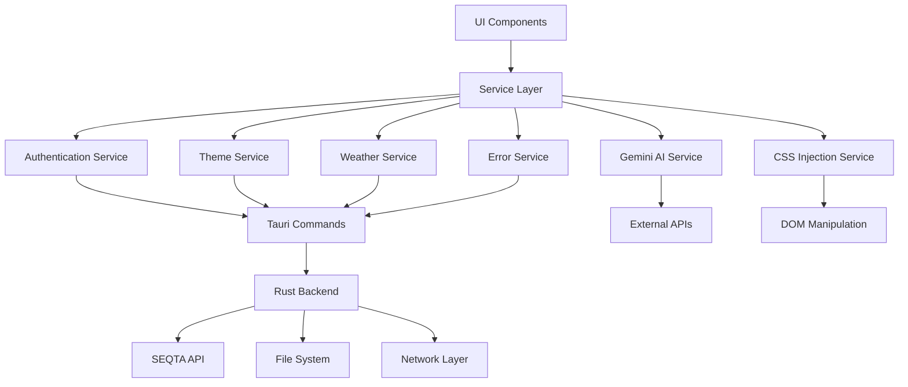

# Utility Functions & Service Layers

This document provides a comprehensive overview of DesQTA's utility functions, service layer architecture, and helper functions that provide core functionality across the application.

## 🏗 Service Layer Architecture

DesQTA implements a robust service layer pattern that abstracts business logic, manages external integrations, and provides consistent interfaces for data operations.

### Service Layer Overview



### Service Design Patterns

1. **Singleton Pattern** - Single instance services for global state management
2. **Factory Pattern** - Service creation and configuration
3. **Observer Pattern** - Event-driven service communication
4. **Strategy Pattern** - Pluggable service implementations
5. **Facade Pattern** - Simplified interfaces for complex operations

## 🔐 Authentication Service

The Authentication Service manages user sessions, login flows, and user information retrieval.

### Core Interface

```typescript
export interface UserInfo {
  clientIP: string;
  email: string;
  id: number;
  lastAccessedTime: number;
  meta: {
    code: string;
    governmentID: string;
  };
  personUUID: string;
  saml: [{
    autologin: boolean;
    label: string;
    method: string;
    request: string;
    sigalg: URL;
    signature: string;
    slo: boolean;
    url: URL;
  }];
  status: string;
  type: string;
  userCode: string;
  userDesc: string;
  userName: string;
  displayName?: string;
  profilePicture?: string;
}

export const authService = {
  // Session management
  async checkSession(): Promise<boolean>;
  async startLogin(seqtaUrl: string): Promise<void>;
  async logout(): Promise<boolean>;
  
  // User data
  async loadUserInfo(options?: { disableSchoolPicture?: boolean }): Promise<UserInfo | undefined>;
  
  // Profile management
  async updateUserProfile(updates: Partial<UserInfo>): Promise<void>;
};
```

### Implementation Details

#### Session Management

```typescript
async checkSession(): Promise<boolean> {
  console.log('[AUTH_SERVICE] Checking session existence');
  const result = await invoke<boolean>('check_session_exists');
  console.log('[AUTH_SERVICE] Session exists:', result);
  return result;
}

async startLogin(seqtaUrl: string): Promise<void> {
  console.log('[AUTH_SERVICE] Starting login with URL:', seqtaUrl);
  if (!seqtaUrl) {
    console.log('[AUTH_SERVICE] No URL provided, skipping login');
    return;
  }
  console.log('[AUTH_SERVICE] Calling create_login_window backend command');
  await invoke('create_login_window', { url: seqtaUrl });
  console.log('[AUTH_SERVICE] create_login_window command completed');
}
```

#### User Information Loading

```typescript
async loadUserInfo(options?: { disableSchoolPicture?: boolean }): Promise<UserInfo | undefined> {
  try {
    // Cache management
    if (options?.disableSchoolPicture) {
      cache.delete('userInfo');
    }
    
    const cachedUserInfo = cache.get<UserInfo>('userInfo');
    if (cachedUserInfo) {
      return cachedUserInfo;
    }

    // Fetch user data from SEQTA
    const res = await seqtaFetch('/seqta/student/login', {
      method: 'POST',
      headers: { 'Content-Type': 'application/json; charset=utf-8' },
      body: {},
    });

    const userInfo: UserInfo = JSON.parse(res).payload;

    // Handle sensitive info hiding
    let devSensitiveInfoHider = false;
    try {
      const settings = await invoke<{ dev_sensitive_info_hider?: boolean }>('get_settings');
      devSensitiveInfoHider = settings.dev_sensitive_info_hider ?? false;
    } catch (e) {
      devSensitiveInfoHider = false;
    }

    // Profile picture handling
    if (devSensitiveInfoHider) {
      userInfo.profilePicture = getRandomDicebearAvatar();
    } else if (!options?.disableSchoolPicture) {
      const profileImage = await seqtaFetch(`/seqta/student/photo/get`, {
        params: { uuid: userInfo.personUUID, format: 'low' },
        is_image: true,
      });
      userInfo.profilePicture = `data:image/png;base64,${profileImage}`;
    }

    // Cache the result
    cache.set('userInfo', userInfo);
    return userInfo;
  } catch (e) {
    console.error('Failed to load user info:', e);
    return undefined;
  }
}
```

### Usage Patterns

```typescript
// Component usage
let userInfo = $state<UserInfo | undefined>(undefined);
let loading = $state(true);

onMount(async () => {
  try {
    const hasSession = await authService.checkSession();
    if (hasSession) {
      userInfo = await authService.loadUserInfo();
    } else {
      // Redirect to login
      goto('/welcome');
    }
  } catch (error) {
    console.error('Authentication failed:', error);
  } finally {
    loading = false;
  }
});
```

## 🎨 Theme Service

The Theme Service manages dynamic theme loading, CSS injection, and theme configuration.

### Core Interface

```typescript
export interface ThemeManifest {
  name: string;
  version: string;
  description: string;
  author: string;
  license: string;
  compatibility: {
    minVersion: string;
    maxVersion: string;
  };
  preview: {
    thumbnail: string;
    screenshots: string[];
  };
  settings: {
    defaultAccentColor: string;
    defaultTheme: 'light' | 'dark' | 'system';
    supportsLightMode: boolean;
    supportsDarkMode: boolean;
    supportsSystemMode: boolean;
  };
  customProperties: Record<string, string>;
  fonts: {
    primary: string;
    secondary: string;
    monospace: string;
  };
  animations: {
    duration: string;
    easing: string;
    enableEnhanced: boolean;
  };
  features: {
    customScrollbars: boolean;
    glassmorphism: boolean;
    gradients: boolean;
    shadows: boolean;
  };
}

class ThemeService {
  // Theme management
  async loadTheme(themeName: string): Promise<void>;
  async getThemeManifest(themeName: string): Promise<ThemeManifest>;
  async listAvailableThemes(): Promise<string[]>;
  
  // CSS management
  private async loadThemeCSS(themeName: string, manifest: ThemeManifest): Promise<void>;
  private applyCustomProperties(properties: Record<string, string>): void;
  private async loadThemeFonts(fonts: ThemeManifest['fonts']): Promise<void>;
  
  // Utilities
  async resetToDefault(): Promise<void>;
  private removeActiveCSS(): void;
}
```

### Implementation Details

#### Theme Loading

```typescript
async loadTheme(themeName: string): Promise<void> {
  // Default theme handling
  if (themeName === 'default') {
    this.removeActiveCSS();
    this.currentTheme = 'default';
    return;
  }

  try {
    // Load theme manifest
    const manifest = await this.loadThemeManifest(themeName);
    
    // Load CSS files
    await this.loadThemeCSS(themeName, manifest);
    
    // Apply custom properties
    this.applyCustomProperties(manifest.customProperties);
    
    // Load fonts
    await this.loadThemeFonts(manifest.fonts);
    
    // Update current theme
    this.currentTheme = themeName;
    
    // Save to settings
    await this.saveThemePreference(themeName);
  } catch (error) {
    console.error('Failed to load theme:', error);
    // Fallback to default theme
    await this.loadTheme('default');
  }
}
```

#### CSS Management

```typescript
private async loadThemeCSS(themeName: string, manifest: ThemeManifest): Promise<void> {
  // Remove existing theme CSS
  this.removeActiveCSS();
  
  const cssFiles = ['global.css', 'components.css', 'dark.css', 'light.css'];
  
  for (const cssFile of cssFiles) {
    try {
      const cssContent = await invoke<string>('load_theme_css', {
        themeName,
        fileName: cssFile
      });
      
      if (cssContent) {
        const link = document.createElement('link');
        link.rel = 'stylesheet';
        link.type = 'text/css';
        link.href = `data:text/css;base64,${btoa(cssContent)}`;
        link.dataset.themeFile = cssFile;
        
        document.head.appendChild(link);
        this.activeCSSLinks.push(link);
      }
    } catch (error) {
      console.warn(`Failed to load ${cssFile} for theme ${themeName}:`, error);
    }
  }
}

private applyCustomProperties(properties: Record<string, string>): void {
  const root = document.documentElement;
  
  // Clear existing custom properties
  for (const prop of Object.keys(properties)) {
    root.style.removeProperty(`--${prop}`);
  }
  
  // Apply new custom properties
  for (const [key, value] of Object.entries(properties)) {
    root.style.setProperty(`--${key}`, value);
  }
}
```

### Usage Patterns

```typescript
// Theme switching
async function switchTheme(themeName: string) {
  try {
    await themeService.loadTheme(themeName);
    // Theme applied successfully
  } catch (error) {
    console.error('Failed to switch theme:', error);
  }
}

// Theme listing
const availableThemes = await themeService.listAvailableThemes();
```

## 🌤 Weather Service

The Weather Service provides location-based weather data with multiple fallback strategies.

### Core Interface

```typescript
export interface WeatherData {
  temperature: number;
  weathercode: number;
  location: string;
  country: string;
}

interface WeatherSettings {
  weather_enabled: boolean;
  weather_city: string;
  weather_country: string;
  force_use_location: boolean;
}

export const weatherService = {
  // Settings management
  async loadWeatherSettings(): Promise<WeatherSettings>;
  
  // Weather data fetching
  async fetchWeather(city: string, country: string): Promise<WeatherData | null>;
  async fetchWeatherWithIP(): Promise<WeatherData | null>;
  
  // Utilities
  getWeatherIcon(weathercode: number): string;
  formatTemperature(temp: number): string;
};
```

### Implementation Details

#### Location-Based Weather

```typescript
async fetchWeatherWithIP(): Promise<WeatherData | null> {
  const cachedWeather = cache.get<WeatherData>('weather');
  if (cachedWeather) {
    return cachedWeather;
  }

  try {
    let latitude: number, longitude: number, name: string, country: string;

    // IP-based geolocation
    try {
      const ipRes = await fetch('http://ip-api.com/json/');
      const ipJson = await ipRes.json();
      if (ipJson.status !== 'success') throw new Error('IP Geolocation failed');

      latitude = ipJson.lat;
      longitude = ipJson.lon;
      name = ipJson.city;
      country = ipJson.country;
    } catch (geoError) {
      throw new Error('IP geolocation failed and no fallback location provided');
    }

    // Fetch weather data
    const weatherRes = await fetch(
      `https://api.open-meteo.com/v1/forecast?latitude=${latitude}&longitude=${longitude}&current_weather=true&timezone=auto`,
    );
    const weatherJson = await weatherRes.json();

    const weatherData: WeatherData = {
      ...weatherJson.current_weather,
      location: name,
      country,
    };

    // Cache for 15 minutes
    cache.set('weather', weatherData, 15 * 60 * 1000);
    return weatherData;
  } catch (e) {
    console.error('Failed to load weather with IP:', e);
    return null;
  }
}
```

#### City-Based Weather

```typescript
async fetchWeather(weatherCity: string, weatherCountry: string): Promise<WeatherData | null> {
  if (!weatherCity) {
    return null;
  }

  const cachedWeather = cache.get<WeatherData>('weather');
  if (cachedWeather) {
    return cachedWeather;
  }

  try {
    // Geocoding API to get coordinates
    const geoRes = await fetch(
      `https://geocoding-api.open-meteo.com/v1/search?name=${encodeURIComponent(weatherCity)}&countryCode=${encodeURIComponent(weatherCountry)}&count=10&language=en&format=json`,
    );
    const geoJson = await geoRes.json();
    
    if (!geoJson.results || !geoJson.results.length) {
      throw new Error('Location not found');
    }

    const { latitude, longitude, name, country } = geoJson.results[0];
    
    // Fetch weather data
    const weatherRes = await fetch(
      `https://api.open-meteo.com/v1/forecast?latitude=${latitude}&longitude=${longitude}&current_weather=true&timezone=auto`,
    );
    const weatherJson = await weatherRes.json();

    const weatherData: WeatherData = {
      ...weatherJson.current_weather,
      location: name,
      country,
    };

    // Cache for 15 minutes
    cache.set('weather', weatherData, 15 * 60 * 1000);
    return weatherData;
  } catch (e) {
    console.error('Failed to load weather:', e);
    return null;
  }
}
```

## 🚨 Error Service

The Error Service provides centralized error handling, logging, and user notification.

### Core Interface

```typescript
export interface ErrorInfo {
  message: string;
  status?: number;
  stack?: string;
  url?: string;
  timestamp: string;
  userAgent?: string;
}

class ErrorService {
  // Error handling
  handleError(error: any, status?: number, context?: string): void;
  handleManualError(message: string, status?: number): void;
  
  // Navigation
  private navigateToErrorPage(errorInfo: ErrorInfo): void;
  
  // Reporting
  async reportError(errorInfo: ErrorInfo): Promise<void>;
  
  // Global handlers
  private setupGlobalErrorHandlers(): void;
}
```

### Implementation Details

#### Global Error Handling

```typescript
private setupGlobalErrorHandlers(): void {
  // Unhandled promise rejections
  window.addEventListener('unhandledrejection', (event) => {
    this.handleError(event.reason, 500, 'Unhandled Promise Rejection');
  });

  // JavaScript errors
  window.addEventListener('error', (event) => {
    this.handleError(event.error || event.message, 500, 'JavaScript Error');
  });

  // Svelte errors (custom handler)
  if (typeof window !== 'undefined' && 'addEventListener' in window) {
    window.addEventListener('svelte:error', (event: any) => {
      this.handleError(event.detail.error, 500, 'Svelte Error');
    });
  }
}
```

#### Error Processing

```typescript
private handleError(errorInfo: ErrorInfo) {
  // Prevent infinite error loops
  if (this.isHandlingError) {
    console.error('Error while handling error:', errorInfo);
    return;
  }

  this.isHandlingError = true;

  // Log error for debugging
  console.error('Error caught by ErrorService:', errorInfo);

  // Add to error queue
  this.errorQueue.push(errorInfo);

  // Navigate to error page
  this.navigateToErrorPage(errorInfo);

  // Reset flag after a delay
  setTimeout(() => {
    this.isHandlingError = false;
  }, 1000);
}

private navigateToErrorPage(errorInfo: ErrorInfo): void {
  // Store error info for error page
  if (typeof localStorage !== 'undefined') {
    localStorage.setItem('lastError', JSON.stringify(errorInfo));
  }

  // Navigate to error page
  const currentPage = get(page);
  if (currentPage.route.id !== '/error') {
    goto('/error');
  }
}
```

#### Error Reporting

```typescript
async reportError(errorInfo: ErrorInfo): Promise<void> {
  try {
    // Log to console
    console.log('Reporting error to external service:', errorInfo);
    
    // Send to backend analytics
    await invoke('save_analytics', {
      data: JSON.stringify({
        type: 'error',
        ...errorInfo
      })
    });

    // Could also send to external services like Sentry
    // await fetch('/api/errors', {
    //   method: 'POST',
    //   headers: { 'Content-Type': 'application/json' },
    //   body: JSON.stringify(errorInfo)
    // });
  } catch (error) {
    console.error('Failed to report error:', error);
  }
}
```

## 🤖 Gemini AI Service

The Gemini AI Service integrates Google's Gemini AI for grade predictions and lesson summaries.

### Core Interface

```typescript
interface GradePrediction {
  subject: string;
  predictedGrade: number;
  confidence: number;
  reasoning: string;
}

interface LessonSummary {
  summary: string;
  steps: string[];
}

export class GeminiService {
  // API management
  static async getApiKey(): Promise<string | null>;
  
  // Grade predictions
  static async predictGrades(assessments: AssessmentData[]): Promise<GradePrediction[]>;
  
  // Lesson summaries
  static async summarizeLessonContent(lesson: {
    title: string;
    content: string;
    attachments: { name: string }[];
  }): Promise<LessonSummary | null>;
  
  // Internal methods
  private static buildPredictionPrompt(subject: string, assessments: any[]): string;
  private static async callGeminiAPI(prompt: string, apiKey: string): Promise<any>;
}
```

### Implementation Details

#### Grade Prediction

```typescript
static async predictGrades(assessments: AssessmentData[]): Promise<GradePrediction[]> {
  const apiKey = await this.getApiKey();
  if (!apiKey) {
    throw new Error('No Gemini API key set. Please add your API key in Settings.');
  }

  try {
    // Group assessments by subject
    const assessmentsBySubject = new Map<string, AssessmentData[]>();
    
    assessments.forEach(assessment => {
      if (!assessmentsBySubject.has(assessment.subject)) {
        assessmentsBySubject.set(assessment.subject, []);
      }
      assessmentsBySubject.get(assessment.subject)!.push(assessment);
    });

    const predictions: GradePrediction[] = [];

    for (const [subject, subjectAssessments] of assessmentsBySubject) {
      // Filter for completed assessments with grades
      const completedAssessments = subjectAssessments.filter(a => 
        a.status === 'MARKS_RELEASED' && a.finalGrade !== undefined
      );

      if (completedAssessments.length === 0) {
        continue; // Skip subjects without completed assessments
      }

      // Prepare data for AI
      const assessmentData = completedAssessments.map(a => ({
        title: a.title,
        grade: a.finalGrade,
        dueDate: a.due,
        status: a.status
      }));

      const prompt = this.buildPredictionPrompt(subject, assessmentData);
      
      const prediction = await this.callGeminiAPI(prompt, apiKey);
      if (prediction) {
        predictions.push(prediction);
      }
    }

    return predictions;
  } catch (error) {
    console.error('Error predicting grades:', error);
    throw new Error('Failed to generate grade predictions');
  }
}
```

#### Prompt Engineering

```typescript
private static buildPredictionPrompt(subject: string, assessments: any[]): string {
  const assessmentList = assessments.map(a => 
    `- ${a.title}: ${a.grade}% (due: ${new Date(a.due).toLocaleDateString()})`
  ).join('\n');

  const averageGrade = assessments.reduce((sum, a) => sum + a.grade, 0) / assessments.length;

  return `You are an AI educational assistant analyzing student performance data. 

Given the following assessment results for ${subject}:

${assessmentList}

Current average: ${averageGrade.toFixed(1)}%

Based on this data, predict the student's final grade for ${subject} this year. Consider:
- Performance trends
- Consistency of grades
- Subject difficulty patterns
- Recent performance improvements or declines

Respond with ONLY a JSON object in this exact format:
{
  "subject": "${subject}",
  "predictedGrade": [number between 0-100],
  "confidence": [number between 0-100 representing confidence level],
  "reasoning": "[brief explanation of prediction]"
}

Be realistic and consider that the prediction should be based on demonstrated performance patterns.`;
}
```

#### API Communication

```typescript
private static async callGeminiAPI(prompt: string, apiKey: string): Promise<GradePrediction | null> {
  try {
    const response = await fetch(`${GEMINI_API_URL}?key=${apiKey}`, {
      method: 'POST',
      headers: {
        'Content-Type': 'application/json',
      },
      body: JSON.stringify({
        contents: [{
          parts: [{
            text: prompt
          }]
        }],
        generationConfig: {
          temperature: 0.3,
          topK: 40,
          topP: 0.95,
          maxOutputTokens: 1024,
        }
      })
    });

    if (!response.ok) {
      throw new Error(`Gemini API error: ${response.status}`);
    }

    const data = await response.json();
    
    if (!data.candidates || !data.candidates[0] || !data.candidates[0].content) {
      throw new Error('Invalid response from Gemini API');
    }

    const responseText = data.candidates[0].content.parts[0].text;
    
    // Extract JSON from response
    const jsonMatch = responseText.match(/\{[\s\S]*\}/);
    if (!jsonMatch) {
      throw new Error('No JSON found in response');
    }

    const prediction = JSON.parse(jsonMatch[0]);
    
    // Validate prediction format
    if (!prediction.subject || typeof prediction.predictedGrade !== 'number' || 
        typeof prediction.confidence !== 'number' || !prediction.reasoning) {
      throw new Error('Invalid prediction format');
    }

    return prediction as GradePrediction;
  } catch (error) {
    console.error('Error calling Gemini API:', error);
    return null;
  }
}
```

## 🎨 CSS Injection Service

The CSS Injection Service manages dynamic CSS injection for themes and custom styles.

### Core Interface

```typescript
class CSSInjectionService {
  // CSS management
  injectCSS(id: string, css: string): void;
  removeCSS(id: string): void;
  
  // Theme-specific methods
  injectThemeCSS(themeName: string, css: string): void;
  injectCustomCSS(userCSS: string): void;
  
  // Utilities
  removeAllCSS(): void;
  getInjectedCSS(id: string): string | null;
  hasInjectedCSS(id: string): boolean;
}
```

### Implementation Details

```typescript
class CSSInjectionService {
  private injectedStyles: Map<string, HTMLStyleElement> = new Map();
  
  injectCSS(id: string, css: string): void {
    // Remove existing style if present
    this.removeCSS(id);
    
    const style = document.createElement('style');
    style.id = `theme-${id}`;
    style.textContent = css;
    
    document.head.appendChild(style);
    this.injectedStyles.set(id, style);
  }
  
  removeCSS(id: string): void {
    const existing = this.injectedStyles.get(id);
    if (existing) {
      existing.remove();
      this.injectedStyles.delete(id);
    }
  }
  
  injectThemeCSS(themeName: string, css: string): void {
    this.injectCSS(`theme-${themeName}`, css);
  }
  
  injectCustomCSS(userCSS: string): void {
    this.injectCSS('user-custom', userCSS);
  }
  
  removeAllCSS(): void {
    this.injectedStyles.forEach((style) => {
      style.remove();
    });
    this.injectedStyles.clear();
  }
}

export const cssInjectionService = new CSSInjectionService();
```

## 🛠 Utility Functions

DesQTA provides a comprehensive set of utility functions for common operations.

### Network Utilities (`src/utils/netUtil.ts`)

#### Core Network Interface

```typescript
export type SeqtaRequestInit = {
  method?: 'GET' | 'POST';
  headers?: Record<string, string>;
  body?: Record<string, any>;
  params?: Record<string, string>;
  is_image?: boolean;
  return_url?: boolean;
};

// Main network functions
export async function seqtaFetch(input: string, init?: SeqtaRequestInit): Promise<any>;
export async function getRSS(url: string): Promise<any>;
export async function openURL(url: string): Promise<any>;
export async function uploadSeqtaFile(fileName: string, filePath: string): Promise<string>;
```

#### SEQTA API Integration

```typescript
export async function seqtaFetch(input: string, init?: SeqtaRequestInit): Promise<any> {
  // Check for dev/mock mode
  let useMock = false;
  try {
    const settings = await invoke<{ dev_sensitive_info_hider?: boolean }>('get_settings');
    useMock = settings.dev_sensitive_info_hider ?? false;
  } catch (e) {
    useMock = false;
  }
  
  if (useMock) {
    return mockApiResponse(input);
  }
  
  try {
    const response = await invoke('fetch_api_data', {
      url: input,
      method: init?.method || 'GET',
      headers: init?.headers || {},
      body: init?.body || {},
      parameters: init?.params || {},
      isImage: init?.is_image || false,
      returnUrl: init?.return_url || false,
    });
    
    return response;
  } catch (error) {
    throw new Error(error instanceof Error ? error.message : 'Unknown fetch error');
  }
}
```

#### File Upload Handling

```typescript
export async function uploadSeqtaFile(fileName: string, filePath: string): Promise<string> {
  try {
    const response = await invoke<string>('upload_seqta_file', {
      fileName: fileName,
      filePath: filePath,
    });
    return response;
  } catch (error) {
    console.error('uploadSeqtaFile error:', error);
    throw new Error(error instanceof Error ? error.message : 'Unknown upload error');
  }
}
```

#### RSS Feed Processing

```typescript
export async function getRSS(url: string): Promise<any> {
  try {
    const response = await invoke('get_rss_feed', {
      feed: url,
    });
    return response;
  } catch (error) {
    console.error('getRSS error:', error);
    throw new Error(error instanceof Error ? error.message : 'Unknown fetch error');
  }
}
```

### Error Handling Utilities (`src/utils/errorHandler.ts`)

#### Function Wrappers

```typescript
// Async function wrapper with error handling
export async function withErrorHandling<T>(
  fn: () => Promise<T>,
  errorMessage?: string,
  status: number = 500
): Promise<T | null> {
  try {
    return await fn();
  } catch (error) {
    const message = errorMessage || (error instanceof Error ? error.message : 'An error occurred');
    errorService.handleManualError(message, status);
    return null;
  }
}

// Safe function factory
export function createSafeAsyncFunction<T extends any[], R>(
  fn: (...args: T) => Promise<R>,
  errorMessage?: string,
  status: number = 500
) {
  return async (...args: T): Promise<R | null> => {
    try {
      return await fn(...args);
    } catch (error) {
      const message = errorMessage || (error instanceof Error ? error.message : 'An error occurred');
      errorService.handleManualError(message, status);
      return null;
    }
  };
}

// Synchronous function wrapper
export function createSafeSyncFunction<T extends any[], R>(
  fn: (...args: T) => R,
  errorMessage?: string,
  status: number = 500
) {
  return (...args: T): R | null => {
    try {
      return fn(...args);
    } catch (error) {
      const message = errorMessage || (error instanceof Error ? error.message : 'An error occurred');
      errorService.handleManualError(message, status);
      return null;
    }
  };
}
```

#### Network Error Handling

```typescript
// Safe fetch wrapper
export async function safeFetch(
  input: RequestInfo | URL,
  init?: RequestInit,
  errorMessage?: string
): Promise<Response | null> {
  try {
    const response = await fetch(input, init);
    
    if (!response.ok) {
      const message = errorMessage || `HTTP ${response.status}: ${response.statusText}`;
      errorService.handleManualError(message, response.status);
      return null;
    }
    
    return response;
  } catch (error) {
    const message = errorMessage || 'Network error occurred';
    errorService.handleManualError(message, 500);
    return null;
  }
}

// Safe Tauri invoke wrapper
export async function safeInvoke<T>(
  command: string,
  args?: Record<string, any>,
  errorMessage?: string
): Promise<T | null> {
  try {
    const { invoke } = await import('@tauri-apps/api/core');
    return await invoke<T>(command, args);
  } catch (error) {
    const message = errorMessage || (error instanceof Error ? error.message : 'Tauri command failed');
    errorService.handleManualError(message, 500);
    return null;
  }
}
```

### Notification Utilities (`src/utils/notify.ts`)

#### Universal Notification Interface

```typescript
export interface UniversalNotificationOptions extends NotificationOptions {
  channelId?: string; // For Android
}

export async function notify(options: Partial<UniversalNotificationOptions> = {}) {
  // Sensible defaults
  const defaultOptions: NotificationOptions = {
    title: 'Notification',
    body: 'You have a new notification.',
    icon: undefined,
    sound: undefined,
    silent: false,
  };

  // Merge user options with defaults
  const merged: NotificationOptions = { ...defaultOptions, ...options };

  // Check and request permission if needed
  let permissionGranted = await isPermissionGranted();
  if (!permissionGranted) {
    const permission = await requestPermission();
    permissionGranted = permission === 'granted';
  }

  if (permissionGranted) {
    // Send the notification
    if (options.channelId) {
      sendNotification({ ...merged, channelId: options.channelId });
    } else {
      sendNotification(merged);
    }
  } else {
    console.warn('Notification permission not granted.');
  }
}
```

#### Usage Examples

```typescript
// Basic notification
await notify({
  title: 'New Message',
  body: 'You have received a new message from John'
});

// Advanced notification with custom options
await notify({
  title: 'Assessment Due',
  body: 'Your Mathematics assignment is due tomorrow',
  icon: '/icons/assessment.png',
  sound: 'default',
  channelId: 'assessments' // Android-specific
});
```

### Cache Utilities (`src/utils/cache.ts`)

#### Cache Implementation

```typescript
interface CacheItem<T> {
  data: T;
  timestamp: number;
  size?: number;
}

class Cache {
  private static instance: Cache;
  private cache: Map<string, CacheItem<any>>;
  private defaultTTL: number = 5; // 5 minutes default
  private maxSize: number = 100 * 1024 * 1024; // 100MB
  private currentSize: number = 0;

  // TTL presets in minutes
  static readonly TTL = {
    SHORT: 5,        // 5 minutes
    MEDIUM: 15,      // 15 minutes
    LONG: 60,        // 1 hour
    VERY_LONG: 1440, // 24 hours
  };

  private constructor() {
    this.cache = new Map();
    this.startCleanupInterval();
  }

  public static getInstance(): Cache {
    if (!Cache.instance) {
      Cache.instance = new Cache();
    }
    return Cache.instance;
  }

  public set<T>(key: string, data: T, ttlMinutes: number = this.defaultTTL): void {
    const serialized = JSON.stringify(data);
    const size = new Blob([serialized]).size;
    
    // Memory management
    while (this.currentSize + size > this.maxSize && this.cache.size > 0) {
      this.evictLRU();
    }
    
    this.cache.set(key, {
      data,
      timestamp: Date.now() + ttlMinutes * 60 * 1000,
      size,
    });
    
    this.currentSize += size;
  }

  public get<T>(key: string): T | null {
    const item = this.cache.get(key);
    if (!item) return null;

    // Check expiration
    if (Date.now() > item.timestamp) {
      this.delete(key);
      return null;
    }

    return item.data as T;
  }

  public delete(key: string): void {
    const item = this.cache.get(key);
    if (item) {
      this.cache.delete(key);
      this.currentSize -= item.size || 0;
    }
  }

  public clear(): void {
    this.cache.clear();
    this.currentSize = 0;
  }

  private startCleanupInterval(): void {
    setInterval(() => {
      const now = Date.now();
      for (const [key, item] of this.cache.entries()) {
        if (now > item.timestamp) {
          this.delete(key);
        }
      }
    }, 5 * 60 * 1000); // Clean up every 5 minutes
  }
}

export const cache = Cache.getInstance();
```

## 🔧 Backend Utilities (Rust)

DesQTA's Rust backend provides comprehensive utility functions for system integration.

### Network Layer (`src-tauri/src/utils/netgrab.rs`)

#### HTTP Client Management

```rust
use reqwest::{self, RequestBuilder, Client};
use std::sync::OnceLock;

static GLOBAL_CLIENT: OnceLock<reqwest::Client> = OnceLock::new();

pub fn create_client() -> &'static reqwest::Client {
    GLOBAL_CLIENT.get_or_init(|| {
        let mut headers = reqwest::header::HeaderMap::new();

        headers.insert(
            reqwest::header::USER_AGENT,
            "Mozilla/5.0 (DesQTA)".parse().unwrap(),
        );
        headers.insert(
            reqwest::header::ACCEPT,
            "application/json, text/plain, */*".parse().unwrap(),
        );
        headers.insert(
            reqwest::header::ACCEPT_LANGUAGE,
            "en-US,en;q=0.9".parse().unwrap(),
        );

        reqwest::Client::builder()
            .default_headers(headers)
            .build()
            .expect("Failed to create HTTP client")
    })
}
```

#### API Data Fetching

```rust
pub async fn fetch_api_data(
    url: &str,
    method: RequestMethod,
    headers: Option<HashMap<String, String>>,
    body: Option<Value>,
    parameters: Option<HashMap<String, String>>,
    is_image: bool,
    return_url: bool
) -> Result<String, String> {
    let client = create_client();
    let mut session = session::Session::load();
    
    let full_url = if url.starts_with("http") {
        url.to_string()
    } else {
        format!("{}{}", session.base_url.parse::<String>().unwrap(), url)
    };

    let mut request = match method {
        RequestMethod::GET => client.get(&full_url),
        RequestMethod::POST => client.post(&full_url),
    };

    request = append_default_headers(request).await;

    // Add custom headers
    if let Some(headers) = headers {
        for (key, value) in headers {
            request = request.header(&key, value);
        }
    }

    // Add query parameters
    if let Some(params) = parameters {
        request = request.query(&params);
    }

    // Add body for POST requests
    if let RequestMethod::POST = method {
        let mut final_body = body.unwrap_or_else(|| json!({}));
        
        // JWT token handling
        if session.jsessionid.starts_with("eyJ") {
            if let Some(body_obj) = final_body.as_object_mut() {
                body_obj.insert("jwt".to_string(), json!(session.jsessionid));
            }
        }
        
        request = request.json(&final_body);
    }

    // Execute request
    match request.send().await {
        Ok(resp) => {
            if is_image {
                let bytes = resp.bytes().await.map_err(|e| e.to_string())?;
                let base64_str = general_purpose::STANDARD.encode(&bytes);
                Ok(base64_str)
            } else if return_url {
                let url = String::from(resp.url().as_str());
                Ok(url)
            } else {
                let text = resp.text().await.map_err(|e| e.to_string())?;
                Ok(text)
            }
        }
        Err(e) => Err(format!("HTTP request failed: {e}")),
    }
}
```

#### File Upload Implementation

```rust
#[tauri::command]
pub async fn upload_seqta_file(file_name: String, file_path: String) -> Result<String, String> {
    let client = create_client();
    let session = session::Session::load();

    // Read file content
    let file_content = fs::read(&file_path)
        .map_err(|e| format!("Failed to read file: {}", e))?;
    
    let url = format!("{}/seqta/student/file/upload/xhr2", session.base_url.parse::<String>().unwrap());
    let mut request = client.post(&url);
    request = append_default_headers(request).await;

    let url_filename: String = form_urlencoded::byte_serialize(&file_name.as_bytes()).collect();

    // Set headers exactly like the web UI
    request = request.header("X-File-Name", url_filename);
    request = request.header("X-Accept-Mimes", "null");
    request = request.header("X-Requested-With", "XMLHttpRequest");

    match request.body(file_content).send().await {
        Ok(resp) => {
            let text = resp.text().await.map_err(|e| e.to_string())?;
            Ok(text)
        },
        Err(e) => Err(format!("File upload failed: {e}")),
    }
}
```

### Settings Management (`src-tauri/src/utils/settings.rs`)

#### Settings Structure

```rust
#[derive(Debug, Serialize, Deserialize, Clone)]
pub struct Settings {
    pub shortcuts: Vec<Shortcut>,
    pub feeds: Vec<Feed>,
    pub weather_enabled: bool,
    pub weather_city: String,
    pub weather_country: String,
    pub reminders_enabled: bool,
    pub force_use_location: bool,
    pub accent_color: String,
    pub theme: String,
    pub disable_school_picture: bool,
    pub enhanced_animations: bool,
    pub gemini_api_key: Option<String>,
    pub ai_integrations_enabled: Option<bool>,
    pub grade_analyser_enabled: Option<bool>,
    pub lesson_summary_analyser_enabled: Option<bool>,
    pub auto_collapse_sidebar: bool,
    pub auto_expand_sidebar_hover: bool,
    pub global_search_enabled: bool,
    pub current_theme: Option<String>,
    pub widget_layout: Vec<WidgetLayout>,
    pub dev_sensitive_info_hider: bool,
}

impl Settings {
    pub fn load() -> Self {
        let path = settings_file();
        if let Ok(mut file) = fs::File::open(&path) {
            let mut contents = String::new();
            if file.read_to_string(&mut contents).is_ok() {
                if let Ok(settings) = serde_json::from_str::<Settings>(&contents) {
                    return settings;
                }
                
                // Smart merge with existing JSON
                if let Ok(existing_json) = serde_json::from_str::<serde_json::Value>(&contents) {
                    return Self::merge_with_existing(existing_json);
                }
            }
        }
        Settings::default()
    }

    pub fn save(&self) -> io::Result<()> {
        let path = settings_file();
        fs::write(path, serde_json::to_string(self).unwrap())
    }

    pub fn to_json(&self) -> Result<String, String> {
        serde_json::to_string(self).map_err(|e| e.to_string())
    }

    pub fn from_json(json: &str) -> Result<Self, String> {
        serde_json::from_str(json).map_err(|e| e.to_string())
    }
}
```

#### Cloud Synchronization

```rust
#[tauri::command]
pub async fn upload_settings_to_cloud() -> Result<(), String> {
    let cloud_token = CloudToken::load();
    let token = cloud_token.token.clone().ok_or("No cloud token found")?;
    
    let settings = Settings::load();
    let settings_json = settings.to_json()?;
    
    let client = reqwest::Client::new();
    let form = reqwest::multipart::Form::new()
        .text("filename", "desqta-settings.json")
        .text("data", settings_json);

    let response = client
        .post(&format!("{}/api/files/upload", base_url))
        .header("Authorization", format!("Bearer {}", token))
        .multipart(form)
        .send()
        .await
        .map_err(|e| format!("Network error: {}", e))?;

    if !response.status().is_success() {
        let error_text = response.text().await.unwrap_or_else(|_| "Unknown error".to_string());
        return Err(format!("Upload failed: {}", error_text));
    }

    Ok(())
}

#[tauri::command]
pub async fn download_settings_from_cloud() -> Result<Settings, String> {
    let cloud_token = CloudToken::load();
    let token = cloud_token.token.clone().ok_or("No cloud token found")?;
    
    // List files to find settings
    let client = reqwest::Client::new();
    let response = client
        .get(&format!("{}/api/files/list", base_url))
        .header("Authorization", format!("Bearer {}", token))
        .query(&[("search", "desqta-settings.json"), ("limit", "10")])
        .send()
        .await
        .map_err(|e| format!("Network error: {}", e))?;

    if !response.status().is_success() {
        return Err("Failed to list files".to_string());
    }

    let file_list: FileListResponse = response.json().await
        .map_err(|e| format!("Failed to parse response: {}", e))?;

    let settings_file = file_list.files.iter()
        .find(|file| file.filename == "desqta-settings.json")
        .ok_or("No settings file found in cloud")?;

    // Download the file
    let download_response = client
        .get(&format!("{}/api/files/{}", base_url, settings_file.stored_name))
        .header("Authorization", format!("Bearer {}", token))
        .send()
        .await
        .map_err(|e| format!("Network error: {}", e))?;

    if !download_response.status().is_success() {
        return Err("Failed to download settings".to_string());
    }

    let settings_text = download_response.text().await
        .map_err(|e| format!("Failed to read response: {}", e))?;

    Settings::from_json(&settings_text)
}
```

### Cloud Messaging (`src-tauri/src/utils/cloudmessaging.rs`)

#### Message Structures

```rust
#[derive(Debug, Serialize, Deserialize, Clone)]
pub struct Friend {
    pub id: String,
    pub username: String,
    #[serde(default)]
    #[serde(rename = "displayName")]
    pub display_name: Option<String>,
    #[serde(default)]
    #[serde(rename = "pfpUrl")]
    pub pfp_url: Option<String>,
}

#[derive(Debug, Serialize, Deserialize, Clone)]
pub struct Message {
    pub id: String,
    pub senderId: String,
    pub receiverId: Option<String>,
    pub groupId: Option<String>,
    pub content: String,
    pub read: bool,
    pub createdAt: String,
    pub replyToId: Option<String>,
    pub replyTo: Option<MessageReply>,
    pub attachmentId: Option<String>,
    pub attachment: Option<Attachment>,
    pub sender: Option<Friend>,
    pub receiver: Option<Friend>,
    pub group: Option<Group>,
}
```

#### API Integration

```rust
async fn get_auth_client(token: &str) -> Client {
    let mut headers = reqwest::header::HeaderMap::new();
    headers.insert(
        reqwest::header::AUTHORIZATION,
        format!("Bearer {}", token).parse().unwrap(),
    );
    headers.insert(
        reqwest::header::CONTENT_TYPE,
        "application/json".parse().unwrap(),
    );
    Client::builder()
        .default_headers(headers)
        .build()
        .unwrap()
}

#[tauri::command]
pub async fn send_message(
    token: String,
    content: String,
    receiver_id: Option<String>,
    group_id: Option<String>,
    reply_to_id: Option<String>,
    attachment_id: Option<String>,
) -> Result<Message, String> {
    let client = get_auth_client(&token).await;
    
    let chat_id = if let Some(ref gid) = group_id {
        gid.clone()
    } else if let Some(ref rid) = receiver_id {
        rid.clone()
    } else {
        return Err("No recipient specified".to_string());
    };
    
    let url = format!("{}/api/messages/{}", BASE_URL, chat_id);
    let mut body = serde_json::Map::new();
    body.insert("content".to_string(), serde_json::json!(content));
    
    if let Some(ref rid) = reply_to_id { 
        body.insert("replyToId".to_string(), serde_json::json!(rid)); 
    }
    if let Some(ref aid) = attachment_id { 
        body.insert("attachmentId".to_string(), serde_json::json!(aid)); 
    }
    
    let resp = client.post(&url).json(&body).send().await.map_err(|e| e.to_string())?;
    
    if !resp.status().is_success() {
        return Err(format!("Failed to send message: {}", resp.status()));
    }

    let mut msg: Message = resp.json().await.map_err(|e| e.to_string())?;
    
    // Fill in missing fields
    if msg.receiverId.is_none() { msg.receiverId = receiver_id; }
    if msg.groupId.is_none() { msg.groupId = group_id; }
    if msg.replyToId.is_none() { msg.replyToId = reply_to_id; }
    if msg.attachmentId.is_none() { msg.attachmentId = attachment_id; }
    
    Ok(msg)
}
```

## 📋 Usage Patterns & Best Practices

### Service Integration

```typescript
// Component using multiple services
export class DashboardComponent {
  private userInfo = $state<UserInfo | undefined>(undefined);
  private weatherData = $state<WeatherData | null>(null);
  private loading = $state(true);
  private error = $state<string | null>(null);

  async onMount() {
    try {
      // Load data from multiple services
      const [user, weather] = await Promise.all([
        authService.loadUserInfo(),
        this.loadWeatherData()
      ]);

      this.userInfo = user;
      this.weatherData = weather;
    } catch (err) {
      this.error = err instanceof Error ? err.message : 'Unknown error';
      errorService.handleError(err, 500, 'Dashboard Load Failed');
    } finally {
      this.loading = false;
    }
  }

  private async loadWeatherData(): Promise<WeatherData | null> {
    const settings = await weatherService.loadWeatherSettings();
    
    if (!settings.weather_enabled) {
      return null;
    }

    if (settings.force_use_location) {
      return weatherService.fetchWeatherWithIP();
    } else {
      return weatherService.fetchWeather(settings.weather_city, settings.weather_country);
    }
  }
}
```

### Error Handling Patterns

```typescript
// Service method with comprehensive error handling
async function loadUserData(userId: string): Promise<UserInfo | null> {
  return withErrorHandling(async () => {
    // Check cache first
    const cached = cache.get<UserInfo>(`user_${userId}`);
    if (cached) {
      return cached;
    }

    // Fetch from API
    const response = await safeInvoke<UserInfo>('get_user_info', { userId });
    if (!response) {
      throw new Error('Failed to fetch user information');
    }

    // Cache the result
    cache.set(`user_${userId}`, response, Cache.TTL.MEDIUM);
    return response;
  }, `Failed to load user data for ID: ${userId}`);
}
```

### Theme Integration

```typescript
// Component with theme awareness
export class ThemedComponent {
  private currentTheme = $state('default');
  private accentColor = $state('#3b82f6');

  async onMount() {
    // Subscribe to theme changes
    theme.subscribe((newTheme) => {
      this.currentTheme = newTheme;
    });

    accentColor.subscribe((newColor) => {
      this.accentColor = newColor;
    });

    // Load current theme
    await themeService.loadCurrentTheme();
  }

  async switchTheme(themeName: string) {
    try {
      await themeService.loadAndApplyTheme(themeName);
      await notify({
        title: 'Theme Changed',
        body: `Successfully switched to ${themeName} theme`
      });
    } catch (error) {
      errorService.handleError(error, 500, 'Theme Switch Failed');
    }
  }
}
```

## 🔮 Future Enhancements

### Planned Service Improvements

1. **Service Worker Integration**
   - Background sync capabilities
   - Offline-first architecture
   - Push notification handling

2. **Advanced Caching**
   - Distributed caching strategies
   - Cache invalidation patterns
   - Memory usage optimization

3. **Plugin Architecture**
   - Extensible service system
   - Third-party integrations
   - Custom service development

4. **Real-time Features**
   - WebSocket service layer
   - Live data synchronization
   - Collaborative features

### Implementation Roadmap

```typescript
// Future plugin system
interface ServicePlugin {
  name: string;
  version: string;
  dependencies: string[];
  
  initialize(context: ServiceContext): Promise<void>;
  destroy(): Promise<void>;
  
  getService<T>(name: string): T | null;
}

// Future real-time service
class RealtimeService {
  private ws: WebSocket | null = null;
  private subscribers = new Map<string, Set<Function>>();

  async connect(): Promise<void> {
    // WebSocket connection logic
  }

  subscribe(channel: string, callback: Function): () => void {
    // Subscription management
  }

  publish(channel: string, data: any): void {
    // Message publishing
  }
}
```

---

**Related Documentation:**
- [Data Flow & State Management](./data-flow.md) - Comprehensive data architecture
- [Frontend Architecture](../frontend/README.md) - Overall frontend structure
- [Backend Architecture](../backend/README.md) - Rust backend services
- [Component Library](../frontend/components/README.md) - UI component patterns 