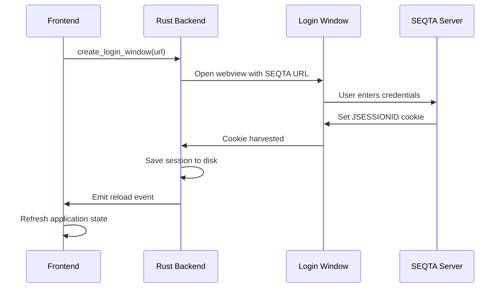
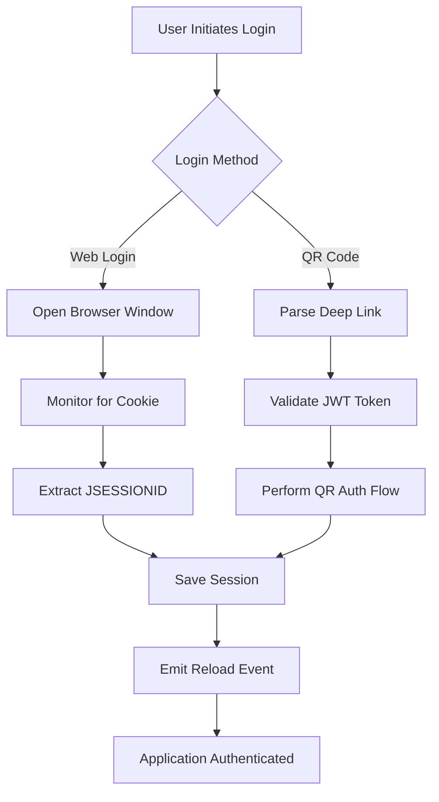

# Authentication System

This document provides an in-depth look at DesQTA's authentication system, covering SEQTA login methods, session management, security implementation, and cloud authentication integration.

## 🏗 Authentication Architecture

DesQTA supports multiple authentication methods to provide flexible and secure access:

1. **Traditional Web Login**: Browser-based SEQTA authentication
2. **QR Code Authentication**: Mobile-friendly deep link authentication
3. **Cloud Authentication**: BetterSEQTA Cloud platform integration
4. **Session Persistence**: Secure local session storage

### Security Principles

- **Zero Trust**: All requests are authenticated and validated
- **Secure Storage**: Sensitive data encrypted at rest
- **Token Validation**: JWT tokens verified for integrity and expiration
- **Session Management**: Automatic session refresh and cleanup
- **Cross-Platform Security**: Consistent security across all platforms

## 🔐 SEQTA Authentication Flow

### Traditional Web Authentication

The traditional authentication method opens a browser window for users to log in through their school's SEQTA portal.

#### Flow Overview



#### Implementation Details

```rust
#[tauri::command]
pub async fn create_login_window(app: tauri::AppHandle, url: String) -> Result<(), String> {
    // Validate and format URL
    let http_url = if url.starts_with("https://") {
        url.clone()
    } else {
        format!("https://{}", url.clone())
    };

    let parsed_url = Url::parse(&http_url)
        .map_err(|e| format!("Invalid URL: {}", e))?;

    let full_url = Url::parse(&format!("{}/#?page=/welcome", parsed_url))
        .map_err(|e| format!("Parsing error: {}", e))?;

    // Create login window
    WebviewWindowBuilder::new(&app, "seqta_login", WebviewUrl::External(full_url.clone()))
        .title("SEQTA Login")
        .inner_size(900.0, 700.0)
        .build()
        .map_err(|e| format!("Failed to build window: {}", e))?;

    // Monitor for successful authentication
    let app_handle_clone = app.clone();
    tokio::spawn(async move {
        let mut counter = 0;
        loop {
            tokio::time::sleep(Duration::from_millis(500)).await;
            counter += 1;
            
            // Check if session was created
            if session::Session::exists() {
                // Close login window and reload app
                if let Some(window) = app_handle_clone.webview_windows().get("seqta_login") {
                    let _ = window.close();
                }
                force_reload(app_handle_clone);
                break;
            }
            
            // Timeout after 2 minutes
            if counter > 240 {
                if let Some(window) = app_handle_clone.webview_windows().get("seqta_login") {
                    let _ = window.close();
                }
                break;
            }
        }
    });
    
    Ok(())
}
```

### QR Code Authentication

QR code authentication provides a seamless mobile-to-desktop experience using deep links.

#### Deep Link Structure

```
seqtalearn://?t={JWT_TOKEN}&u={SERVER_URL}&n={USER_NUMBER}
```

**Parameters:**
- `t`: JWT token containing authentication credentials
- `u`: SEQTA server base URL
- `n`: User number/identifier

#### JWT Token Validation

```rust
#[derive(Debug, Deserialize)]
struct SeqtaJWT {
    exp: i64,       // Expiration timestamp
    // Additional claims as needed
}

fn validate_token(token: &str) -> Result<(), String> {
    // Split JWT into parts (header.payload.signature)
    let parts: Vec<&str> = token.split('.').collect();
    if parts.len() != 3 {
        return Err("Invalid JWT format".to_string());
    }

    // Decode payload (base64url)
    let payload = parts[1];
    let decoded = general_purpose::URL_SAFE_NO_PAD
        .decode(payload)
        .map_err(|_| "Failed to decode JWT payload")?;
    
    let payload_str = String::from_utf8(decoded)
        .map_err(|_| "Invalid UTF-8 in JWT payload")?;
    
    // Parse JWT claims
    let jwt: SeqtaJWT = serde_json::from_str(&payload_str)
        .map_err(|_| "Failed to parse JWT payload")?;

    // Validate expiration
    let now = OffsetDateTime::now_utc().unix_timestamp();
    if jwt.exp <= now {
        return Err("JWT token has expired".to_string());
    }

    Ok(())
}
```

#### Deep Link Processing

```rust
#[derive(Debug, Deserialize, Clone)]
struct SeqtaSSOPayload {
    t: String, // JWT token
    u: String, // Server URL
    n: String, // User number
}

fn parse_deeplink(url: &str) -> Result<SeqtaSSOPayload, String> {
    if !url.starts_with("seqtalearn://") {
        return Err("Invalid deeplink scheme".to_string());
    }

    let url_without_scheme = url.strip_prefix("seqtalearn://").unwrap();
    let decoded = form_urlencoded::parse(url_without_scheme.as_bytes())
        .into_owned()
        .collect::<HashMap<String, String>>();

    let token = decoded.get("t")
        .ok_or("Missing token parameter")?
        .clone();
    let server_url = decoded.get("u")
        .ok_or("Missing server URL parameter")?
        .clone();
    let user_number = decoded.get("n")
        .ok_or("Missing user number parameter")?
        .clone();

    Ok(SeqtaSSOPayload {
        t: token,
        u: server_url,
        n: user_number,
    })
}
```

#### QR Authentication Flow

```rust
async fn perform_qr_auth(sso_payload: SeqtaSSOPayload) -> Result<session::Session, String> {
    let base_url = sso_payload.u;
    let token = sso_payload.t;

    // Create HTTP client with cookie jar
    let jar = Arc::new(Jar::default());
    jar.add_cookie_str(&format!("JSESSIONID={}", &token), &base_url.parse::<Url>().unwrap());
    
    let mut headers = header::HeaderMap::new();
    headers.insert("Content-Type", header::HeaderValue::from_static("application/json"));
    headers.insert("X-User-Number", header::HeaderValue::from_str(&sso_payload.n.clone()).unwrap());
    headers.insert("Accept", header::HeaderValue::from_static("application/json"));
    headers.insert("Authorization", header::HeaderValue::from_str(&format!("Bearer {}", &token)).unwrap());

    let client = reqwest::Client::builder()
        .cookie_provider(jar.clone())
        .cookie_store(true)
        .default_headers(headers)
        .build()
        .unwrap();
    
    // Step 1: Initial login request
    let first_login_url = format!("{}/seqta/student/login", base_url);
    let first_login_body = json!({ "token": &token });
    
    let first_response = client.post(&first_login_url)
        .json(&first_login_body)
        .send()
        .await
        .map_err(|e| format!("First login request failed: {}", e))?;

    if !first_response.status().is_success() {
        return Err(format!("First login failed with status: {}", first_response.status()));
    }

    // Step 2: JWT-based login request
    let second_login_body = json!({ "jwt": &token });
    
    let second_response = client.post(&first_login_url)
        .json(&second_login_body)
        .send()
        .await
        .map_err(|e| format!("Second login request failed: {}", e))?;
    
    if !second_response.status().is_success() {
        return Err(format!("Second login failed with status: {}", second_response.status()));
    }

    // Step 3: Extract JSESSIONID from response headers
    let jsessionid = second_response.headers().get("Set-Cookie")
        .and_then(|v| v.to_str().ok())
        .and_then(|cookie_str| {
            cookie_str.split(';')
                .find(|part| part.trim().starts_with("JSESSIONID="))
                .map(|jsession_part| {
                    jsession_part.trim()
                        .strip_prefix("JSESSIONID=")
                        .unwrap_or("")
                        .to_string()
                })
        });

    // Step 4: Validate session with heartbeat
    let heartbeat_url = format!("{}/seqta/student/heartbeat", base_url);
    let heartbeat_body = json!({ "heartbeat": true });

    let heartbeat_response = client.post(&heartbeat_url)
        .json(&heartbeat_body)
        .send()
        .await
        .map_err(|e| format!("Heartbeat request failed: {}", e))?;

    if !heartbeat_response.status().is_success() {
        return Err(format!("Heartbeat failed with status: {}", heartbeat_response.status()));
    }

    // Create and return session
    let session = session::Session {
        base_url,
        jsessionid: jsessionid.ok_or("Could not get JSESSIONID from response headers")?,
        additional_cookies: vec![],
    };

    Ok(session)
}
```

## 🗃 Session Management

### Session Data Structure

```rust
#[derive(Debug, Serialize, Deserialize, Clone, Default)]
pub struct Session {
    pub base_url: String,           // SEQTA server URL
    pub jsessionid: String,         // Session identifier
    pub additional_cookies: Vec<Cookie>, // Additional authentication cookies
}

#[derive(Debug, Serialize, Deserialize, Clone)]
pub struct Cookie {
    pub name: String,               // Cookie name
    pub value: String,              // Cookie value
    pub domain: Option<String>,     // Cookie domain
    pub path: Option<String>,       // Cookie path
}
```

### Cross-Platform Session Storage

Session data is stored securely on disk with platform-specific paths:

```rust
pub fn session_file() -> PathBuf {
    #[cfg(target_os = "android")]
    {
        // Android: Use app's internal storage
        let mut dir = PathBuf::from("/data/data/com.desqta.app/files");
        dir.push("DesQTA");
        if !dir.exists() {
            fs::create_dir_all(&dir).expect("Unable to create data dir");
        }
        dir.push("session.json");
        dir
    }
    #[cfg(not(target_os = "android"))]
    {
        // Desktop: Use system data directory
        let mut dir = dirs_next::data_dir().expect("Unable to determine data dir");
        dir.push("DesQTA");
        if !dir.exists() {
            fs::create_dir_all(&dir).expect("Unable to create data dir");
        }
        dir.push("session.json");
        dir
    }
}
```

### Session Operations

```rust
impl Session {
    /// Load session from disk
    pub fn load() -> Self {
        let path = session_file();
        if let Ok(mut file) = fs::File::open(path) {
            let mut contents = String::new();
            if file.read_to_string(&mut contents).is_ok() {
                if let Ok(sess) = serde_json::from_str::<Session>(&contents) {
                    return sess;
                }
            }
        }
        Session::default()
    }

    /// Save session to disk
    pub fn save(&self) -> io::Result<()> {
        let path = session_file();
        fs::write(path, serde_json::to_string(self).unwrap())
    }

    /// Check if valid session exists
    pub fn exists() -> bool {
        let s = Self::load();
        !(s.base_url.is_empty() || s.jsessionid.is_empty())
    }

    /// Clear session file
    pub fn clear_file() -> io::Result<()> {
        let path = session_file();
        if path.exists() {
            fs::remove_file(path)?;
        }
        Ok(())
    }
}
```

### Session Commands

```rust
#[tauri::command]
pub fn check_session_exists() -> bool {
    session::Session::exists()
}

#[tauri::command]
pub fn save_session(base_url: String, jsessionid: String) -> Result<(), String> {
    session::Session {
        base_url,
        jsessionid,
        additional_cookies: Vec::new(),
    }
    .save()
    .map_err(|e| e.to_string())
}

#[tauri::command]
pub async fn logout() -> bool {
    // Send logout request to server
    if let Ok(_) = netgrab::clear_session().await {
        true
    } else {
        false
    }
}

#[tauri::command]
pub fn force_reload(app: tauri::AppHandle) {
    app.emit("reload", "hi".to_string()).unwrap();
}
```

## ☁️ Cloud Authentication

### BetterSEQTA Cloud Integration

DesQTA integrates with BetterSEQTA Cloud for enhanced messaging and synchronization features.

#### Cloud User Data Structure

```rust
#[derive(Debug, Serialize, Deserialize, Clone)]
pub struct CloudUser {
    pub id: String,
    pub username: String,
    pub email: String,
    pub displayName: Option<String>,
    pub pfpUrl: Option<String>,
    pub verified: bool,
    pub createdAt: String,
    pub updatedAt: String,
}

#[derive(Debug, Serialize, Deserialize, Clone, Default)]
pub struct CloudToken {
    pub token: Option<String>,
    pub user: Option<CloudUser>,
}

#[derive(Debug, Serialize, Deserialize)]
pub struct CloudUserWithToken {
    pub user: Option<CloudUser>,
    pub token: Option<String>,
}
```

#### Cloud Token Management

```rust
impl CloudToken {
    pub fn load() -> Self {
        let path = cloud_token_file();
        if let Ok(mut file) = fs::File::open(path) {
            let mut contents = String::new();
            if file.read_to_string(&mut contents).is_ok() {
                if let Ok(tok) = serde_json::from_str::<CloudToken>(&contents) {
                    return tok;
                }
            }
        }
        CloudToken::default()
    }
    
    pub fn save(&self) -> io::Result<()> {
        let path = cloud_token_file();
        fs::write(path, serde_json::to_string(self).unwrap())
    }
    
    pub fn clear_file() -> io::Result<()> {
        let path = cloud_token_file();
        if path.exists() {
            fs::remove_file(path)?;
        }
        Ok(())
    }
}
```

#### Cloud Authentication Flow

```rust
#[tauri::command]
pub async fn save_cloud_token(token: String) -> Result<CloudUser, String> {
    let base_url = "https://accounts.betterseqta.adenmgb.com/api";
    let client = reqwest::Client::new();
    
    // Validate token by fetching user info
    let response = client
        .get(&format!("{}/auth/me", base_url))
        .header("Authorization", format!("Bearer {}", token))
        .send()
        .await
        .map_err(|e| format!("Network error: {}", e))?;
    
    let status = response.status();
    if !status.is_success() {
        let error_text = response.text().await
            .unwrap_or_else(|_| "Unknown error".to_string());
        
        // Try to parse API error
        if let Ok(api_error) = serde_json::from_str::<APIError>(&error_text) {
            return Err(format!("API Error {}: {}", 
                api_error.statusCode, 
                api_error.statusMessage
            ));
        }
        
        return Err(format!("Authentication failed: {} - {}", status, error_text));
    }
    
    // Parse user data
    let user_text = response.text().await
        .map_err(|e| format!("Failed to read response: {}", e))?;
    
    let user: CloudUser = serde_json::from_str(&user_text)
        .map_err(|e| format!("Failed to parse user response: {} - Raw response: {}", 
            e, user_text))?;
    
    // Save token and user data
    let mut cloud_token = CloudToken::load();
    cloud_token.token = Some(token);
    cloud_token.user = Some(user.clone());
    cloud_token.save().map_err(|e| e.to_string())?;
    
    Ok(user)
}

#[tauri::command]
pub fn get_cloud_user() -> CloudUserWithToken {
    let cloud_token = CloudToken::load();
    CloudUserWithToken {
        user: cloud_token.user,
        token: cloud_token.token,
    }
}

#[tauri::command]
pub fn clear_cloud_token() -> Result<(), String> {
    CloudToken::clear_file().map_err(|e| e.to_string())
}
```

## 🔒 Security Implementation

### Request Security

All API requests include proper authentication headers and validation:

```rust
async fn append_default_headers(request: RequestBuilder) -> RequestBuilder {
    let session = session::Session::load();
    
    let mut req = request
        .header("Content-Type", "application/json")
        .header("Accept", "application/json")
        .header("X-Requested-With", "XMLHttpRequest");

    // Add session cookie if available
    if !session.jsessionid.is_empty() {
        req = req.header("Cookie", format!("JSESSIONID={}", session.jsessionid));
    }

    // Add additional cookies
    for cookie in &session.additional_cookies {
        req = req.header("Cookie", format!("{}={}", cookie.name, cookie.value));
    }

    req
}
```

### JWT Integration

For JWT-based sessions, tokens are automatically included in request bodies:

```rust
pub async fn fetch_api_data(
    url: &str,
    method: RequestMethod,
    headers: Option<HashMap<String, String>>,
    body: Option<Value>,
    parameters: Option<HashMap<String, String>>,
    is_image: bool,
    return_url: bool
) -> Result<String, String> {
    let client = create_client();
    let mut session = session::Session::load();
    
    // ... request setup ...

    // Add body for POST requests
    if let RequestMethod::POST = method {
        let mut final_body = body.unwrap_or_else(|| json!({}));
        
        // For JWT-based sessions, automatically include the JWT token
        if session.jsessionid.starts_with("eyJ") {
            if let Some(body_obj) = final_body.as_object_mut() {
                body_obj.insert("jwt".to_string(), json!(session.jsessionid));
            }
        }
        
        request = request.json(&final_body);
    }

    // ... rest of implementation ...
}
```

### Error Handling

Comprehensive error handling for authentication failures:

```rust
#[derive(Debug, Serialize, Deserialize)]
pub struct APIError {
    pub statusCode: u16,
    pub statusMessage: String,
    pub details: Option<String>,
}

impl From<reqwest::Error> for APIError {
    fn from(err: reqwest::Error) -> Self {
        APIError {
            statusCode: err.status()
                .map(|s| s.as_u16())
                .unwrap_or(500),
            statusMessage: err.to_string(),
            details: None,
        }
    }
}
```

### Session Cleanup

Secure session cleanup on logout:

```rust
#[tauri::command]
pub async fn clear_session() -> Result<(), String> {
    // Send logout request to server first
    let _ = get_api_data("/saml2?logout", HashMap::new()).await;
    
    // Then clear the local session file
    session::Session::clear_file().map_err(|e| e.to_string())
}
```

## 🛡️ Security Best Practices

### Data Encryption

- **At Rest**: Sensitive data encrypted before storage
- **In Transit**: All network communications use HTTPS/TLS
- **Memory**: Sensitive data cleared from memory after use

### Token Management

- **Expiration**: JWT tokens validated for expiration
- **Rotation**: Automatic token refresh when possible
- **Revocation**: Immediate token invalidation on logout

### Input Validation

- **URL Validation**: All URLs validated before use
- **Parameter Sanitization**: User inputs sanitized
- **Type Safety**: Rust's type system prevents many security issues

### Cross-Platform Security

#### Android Security
```rust
#[cfg(target_os = "android")]
fn get_secure_storage_path() -> PathBuf {
    // Use app's internal storage (not accessible to other apps)
    PathBuf::from("/data/data/com.desqta.app/files/DesQTA")
}
```

#### Desktop Security
```rust
#[cfg(not(target_os = "android"))]
fn get_secure_storage_path() -> PathBuf {
    // Use system data directory with proper permissions
    let mut dir = dirs_next::data_dir().expect("Unable to determine data dir");
    dir.push("DesQTA");
    
    // Set restrictive permissions on Unix systems
    #[cfg(unix)]
    {
        use std::os::unix::fs::PermissionsExt;
        if let Ok(metadata) = fs::metadata(&dir) {
            let mut perms = metadata.permissions();
            perms.set_mode(0o700); // Owner read/write/execute only
            let _ = fs::set_permissions(&dir, perms);
        }
    }
    
    dir
}
```

### Network Security

```rust
fn create_secure_client() -> reqwest::Client {
    reqwest::Client::builder()
        .danger_accept_invalid_certs(false)  // Always validate certificates
        .danger_accept_invalid_hostnames(false)
        .timeout(Duration::from_secs(30))    // Reasonable timeout
        .redirect(reqwest::redirect::Policy::limited(3)) // Limit redirects
        .build()
        .expect("Failed to create secure HTTP client")
}
```

## 🔄 Session Lifecycle Management

### Session Creation Flow



### Session Validation

```rust
pub fn validate_session(session: &Session) -> Result<(), String> {
    // Check required fields
    if session.base_url.is_empty() {
        return Err("Missing base URL".to_string());
    }
    
    if session.jsessionid.is_empty() {
        return Err("Missing session ID".to_string());
    }
    
    // Validate URL format
    if let Err(e) = Url::parse(&session.base_url) {
        return Err(format!("Invalid base URL: {}", e));
    }
    
    // For JWT tokens, validate expiration
    if session.jsessionid.starts_with("eyJ") {
        validate_token(&session.jsessionid)?;
    }
    
    Ok(())
}
```

### Session Refresh

```rust
pub async fn refresh_session_if_needed(session: &mut Session) -> Result<bool, String> {
    // Check if session needs refresh
    if should_refresh_session(session) {
        // Attempt to refresh
        match perform_session_refresh(session).await {
            Ok(new_session) => {
                *session = new_session;
                session.save().map_err(|e| e.to_string())?;
                Ok(true)
            }
            Err(e) => {
                // If refresh fails, clear session
                let _ = Session::clear_file();
                Err(format!("Session refresh failed: {}", e))
            }
        }
    } else {
        Ok(false)
    }
}

fn should_refresh_session(session: &Session) -> bool {
    // Check if JWT token is close to expiration
    if session.jsessionid.starts_with("eyJ") {
        if let Ok(parts) = session.jsessionid.split('.').collect::<Vec<&str>>().try_into() {
            if parts.len() == 3 {
                if let Ok(decoded) = general_purpose::URL_SAFE_NO_PAD.decode(parts[1]) {
                    if let Ok(payload_str) = String::from_utf8(decoded) {
                        if let Ok(jwt) = serde_json::from_str::<SeqtaJWT>(&payload_str) {
                            let now = OffsetDateTime::now_utc().unix_timestamp();
                            // Refresh if expires within 5 minutes
                            return jwt.exp - now < 300;
                        }
                    }
                }
            }
        }
    }
    false
}
```

## 🚨 Security Monitoring

### Authentication Events

```rust
#[derive(Debug, Serialize)]
pub struct AuthEvent {
    pub event_type: String,
    pub timestamp: String,
    pub user_id: Option<String>,
    pub ip_address: Option<String>,
    pub user_agent: Option<String>,
    pub success: bool,
    pub error_message: Option<String>,
}

pub fn log_auth_event(event: AuthEvent) {
    // Log to secure audit trail
    let log_entry = serde_json::to_string(&event).unwrap_or_default();
    
    // In production, this would go to a secure logging service
    #[cfg(debug_assertions)]
    println!("AUTH_EVENT: {}", log_entry);
    
    #[cfg(not(debug_assertions))]
    {
        // Write to secure log file with rotation
        let _ = write_secure_log("auth_events.log", &log_entry);
    }
}
```

### Failed Authentication Handling

```rust
pub async fn handle_auth_failure(
    reason: &str,
    attempt_count: u32,
) -> Result<(), String> {
    // Log the failure
    log_auth_event(AuthEvent {
        event_type: "authentication_failed".to_string(),
        timestamp: OffsetDateTime::now_utc().to_string(),
        user_id: None,
        ip_address: None,
        user_agent: None,
        success: false,
        error_message: Some(reason.to_string()),
    });
    
    // Implement rate limiting
    if attempt_count > 3 {
        // Temporary lockout
        tokio::time::sleep(Duration::from_secs(60 * attempt_count as u64)).await;
    }
    
    // Clear any partial session data
    let _ = Session::clear_file();
    
    Ok(())
}
```

## 🔧 Development and Testing

### Authentication Testing

```rust
#[cfg(test)]
mod auth_tests {
    use super::*;
    
    #[tokio::test]
    async fn test_session_persistence() {
        let session = Session {
            base_url: "https://example.seqta.com".to_string(),
            jsessionid: "test123".to_string(),
            additional_cookies: vec![],
        };
        
        // Test save and load
        session.save().unwrap();
        let loaded = Session::load();
        
        assert_eq!(session.base_url, loaded.base_url);
        assert_eq!(session.jsessionid, loaded.jsessionid);
        
        // Cleanup
        let _ = Session::clear_file();
    }
    
    #[test]
    fn test_jwt_validation() {
        // Test with expired token
        let expired_token = "eyJ0eXAiOiJKV1QiLCJhbGciOiJIUzI1NiJ9.eyJleHAiOjE2MzAwMDAwMDB9.signature";
        assert!(validate_token(expired_token).is_err());
        
        // Test with malformed token
        let malformed_token = "not.a.jwt";
        assert!(validate_token(malformed_token).is_err());
    }
    
    #[test]
    fn test_deeplink_parsing() {
        let valid_link = "seqtalearn://?t=token123&u=https://school.seqta.com&n=12345";
        let result = parse_deeplink(valid_link);
        assert!(result.is_ok());
        
        let payload = result.unwrap();
        assert_eq!(payload.t, "token123");
        assert_eq!(payload.u, "https://school.seqta.com");
        assert_eq!(payload.n, "12345");
        
        // Test invalid scheme
        let invalid_link = "https://example.com";
        assert!(parse_deeplink(invalid_link).is_err());
    }
}
```

### Security Testing

```rust
#[cfg(test)]
mod security_tests {
    use super::*;
    
    #[test]
    fn test_session_validation() {
        // Valid session
        let valid_session = Session {
            base_url: "https://valid.seqta.com".to_string(),
            jsessionid: "valid123".to_string(),
            additional_cookies: vec![],
        };
        assert!(validate_session(&valid_session).is_ok());
        
        // Invalid URL
        let invalid_url_session = Session {
            base_url: "not-a-url".to_string(),
            jsessionid: "valid123".to_string(),
            additional_cookies: vec![],
        };
        assert!(validate_session(&invalid_url_session).is_err());
        
        // Missing fields
        let empty_session = Session::default();
        assert!(validate_session(&empty_session).is_err());
    }
    
    #[test]
    fn test_secure_storage_paths() {
        let path = session_file();
        
        // Ensure path is within app directory
        assert!(path.to_string_lossy().contains("DesQTA"));
        
        // Ensure parent directory exists or can be created
        if let Some(parent) = path.parent() {
            assert!(parent.exists() || std::fs::create_dir_all(parent).is_ok());
        }
    }
}
```

## 🔮 Future Security Enhancements

### Planned Security Features

1. **Biometric Authentication**
   - Fingerprint/Face ID integration on supported platforms
   - Hardware security key support

2. **Enhanced Encryption**
   - End-to-end encryption for cloud messaging
   - Hardware-backed encryption on mobile platforms

3. **Advanced Session Management**
   - Automatic session rotation
   - Device-specific session binding
   - Concurrent session limits

4. **Security Monitoring**
   - Real-time threat detection
   - Anomaly detection for unusual access patterns
   - Integration with security information systems

### Implementation Roadmap

```rust
// Future biometric authentication
#[tauri::command]
pub async fn authenticate_biometric() -> Result<bool, String> {
    #[cfg(target_os = "ios")]
    {
        // Use Touch ID/Face ID
        todo!("Implement iOS biometric authentication")
    }
    
    #[cfg(target_os = "android")]
    {
        // Use Android Biometric API
        todo!("Implement Android biometric authentication")
    }
    
    #[cfg(desktop)]
    {
        // Use Windows Hello/macOS Touch ID
        todo!("Implement desktop biometric authentication")
    }
}

// Future hardware security key support
#[tauri::command]
pub async fn authenticate_security_key() -> Result<bool, String> {
    // Implement WebAuthn/FIDO2 support
    todo!("Implement hardware security key authentication")
}
```

---

**Related Documentation:**
- [Backend Architecture](./README.md) - Overall Rust backend structure
- [Network Services](./network.md) - API communication patterns
- [Frontend Integration](../frontend/README.md) - Frontend authentication flows
- [Security Guidelines](./security.md) - Additional security considerations 