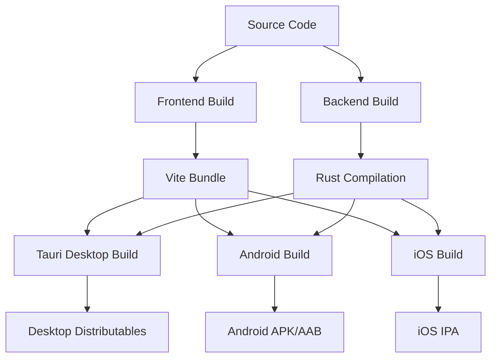

# Build Process, Configuration & Deployment

This document provides a comprehensive guide to DesQTA's build system, configuration management, and deployment processes across multiple platforms.

## 🏗 Build System Architecture

DesQTA uses a sophisticated multi-platform build system combining:

- **Frontend**: Vite + SvelteKit for web assets
- **Backend**: Rust + Cargo for native functionality  
- **Desktop**: Tauri v2 for cross-platform desktop apps
- **Mobile**: Android (Gradle) and iOS (Xcode) native builds
- **CI/CD**: GitHub Actions for automated builds and releases

### Build Pipeline Overview



## 🔧 Development Environment Setup

### Prerequisites

1. **Node.js & Package Manager**
   ```bash
   # Install Node.js 20+
   node --version  # Should be 20.x or higher
   
   # Install pnpm (recommended) or npm
   npm install -g pnpm
   ```

2. **Rust Toolchain**
   ```bash
   # Install Rust via rustup
   curl --proto '=https' --tlsv1.2 -sSf https://sh.rustup.rs | sh
   source ~/.cargo/env
   
   # Verify installation
   rustc --version
   cargo --version
   ```

3. **Tauri CLI**
   ```bash
   # Install Tauri CLI
   npm install -g @tauri-apps/cli
   
   # Verify installation
   tauri --version
   ```

### Platform-Specific Setup

#### Windows Development
```bash
# Install Visual Studio Build Tools or Visual Studio Community
# with C++ build tools and Windows SDK

# Install WebView2 (usually pre-installed on Windows 11)
# Download from Microsoft if needed
```

#### macOS Development
```bash
# Install Xcode Command Line Tools
xcode-select --install

# Install Xcode (for iOS builds)
# Download from Mac App Store
```

#### Linux Development
```bash
# Ubuntu/Debian
sudo apt update
sudo apt install libwebkit2gtk-4.0-dev \
    build-essential \
    curl \
    wget \
    file \
    libssl-dev \
    libgtk-3-dev \
    libayatana-appindicator3-dev \
    librsvg2-dev

# Fedora
sudo dnf install webkit2gtk3-devel openssl-devel curl wget file \
    libappindicator-gtk3-devel librsvg2-devel
```

#### Android Development
```bash
# Install Android Studio or Android SDK
# Set environment variables
export ANDROID_HOME=$HOME/Android/Sdk
export ANDROID_SDK_ROOT=$ANDROID_HOME
export ANDROID_NDK_HOME=$ANDROID_HOME/ndk/25.2.9519653
export PATH=$PATH:$ANDROID_HOME/cmdline-tools/latest/bin
export PATH=$PATH:$ANDROID_HOME/platform-tools

# Install required SDK components
sdkmanager "platform-tools" "platforms;android-34" "build-tools;34.0.0"
sdkmanager "ndk;25.2.9519653"

# Add Android targets to Rust
rustup target add aarch64-linux-android
rustup target add armv7-linux-androideabi  
rustup target add i686-linux-android
rustup target add x86_64-linux-android
```

## 📋 Package Configuration

### Package.json Scripts

```json
{
  "name": "desqta",
  "version": "0.1.0",
  "type": "module",
  "scripts": {
    "start": "npm install && npm run tauri dev",
    "dev": "vite dev",
    "build": "vite build", 
    "preview": "vite preview",
    "check": "svelte-kit sync && svelte-check --tsconfig ./tsconfig.json",
    "check:watch": "svelte-kit sync && svelte-check --tsconfig ./tsconfig.json --watch",
    "format": "prettier --write 'src/**/*.{ts,svelte,css}'",
    "tauri": "tauri"
  },
  "dependencies": {
    "@tailwindcss/typography": "^0.5.16",
    "@tauri-apps/api": "^2.5.0",
    "@tauri-apps/plugin-dialog": "^2.3.0",
    "@tauri-apps/plugin-notification": "^2.2.2",
    "@tauri-apps/plugin-opener": "^2.2.6",
    "@tiptap/core": "^2.12.0",
    "@tiptap/starter-kit": "^2.12.0",
    "chart.js": "^4.4.9",
    "dayjs": "^1.11.13",
    "dompurify": "^3.2.5",
    "html5-qrcode": "^2.3.8",
    "marked": "^15.0.12",
    "motion": "^12.19.1"
  },
  "devDependencies": {
    "@sveltejs/adapter-static": "^3.0.6",
    "@sveltejs/kit": "^2.15.0",
    "@sveltejs/vite-plugin-svelte": "^4.0.0",
    "@tauri-apps/cli": "^2.5.0",
    "autoprefixer": "^10.4.20",
    "postcss": "^8.5.0",
    "prettier": "^3.3.3",
    "svelte": "^5.15.0",
    "svelte-check": "^4.0.8",
    "tailwindcss": "^3.4.16",
    "typescript": "^5.7.2",
    "vite": "^6.0.3"
  }
}
```

### Key Script Explanations

- **`start`**: Complete development setup - installs dependencies and starts dev server
- **`dev`**: Frontend-only development server (port 1420)
- **`build`**: Frontend build only (creates static files)
- **`tauri dev`**: Full development with hot reload (frontend + backend)
- **`tauri build`**: Production build for current platform

## ⚙️ Configuration Files

### Vite Configuration (`vite.config.js`)

```javascript
import { defineConfig } from "vite";
import { sveltekit } from "@sveltejs/kit/vite";
import fs from 'fs';

const host = process.env.TAURI_DEV_HOST;

// Custom plugin to import CSS as text for theme system
function cssAsText() {
  return {
    name: 'css-as-text',
    load(id) {
      if (id.endsWith('.css?text')) {
        const cssPath = id.replace('?text', '');
        const css = fs.readFileSync(cssPath, 'utf-8');
        return `export default ${JSON.stringify(css)}`;
      }
    }
  };
}

export default defineConfig(async () => ({
  plugins: [sveltekit(), cssAsText()],
  
  // Tauri-specific optimizations
  clearScreen: false, // Don't clear console (shows Rust errors)
  
  server: {
    port: 1420,           // Fixed port for Tauri
    strictPort: true,     // Fail if port unavailable
    host: host || false,  // Allow external connections in dev
    hmr: host ? {
      protocol: "ws",
      host,
      port: 1421,
    } : undefined,
    watch: {
      ignored: ["**/src-tauri/**"], // Don't watch Rust files
    },
  },
  
  // Environment variable prefixes
  envPrefix: ['VITE_', 'TAURI_ENV_*', 'TAURI_'],
}));
```

### SvelteKit Configuration (`svelte.config.js`)

```javascript
import adapter from '@sveltejs/adapter-static';
import { vitePreprocess } from '@sveltejs/vite-plugin-svelte';

const config = {
  kit: {
    adapter: adapter({
      pages: 'build',        // Output directory
      assets: 'build',       // Assets directory
      fallback: 'index.html', // SPA fallback
      precompress: false,    // Don't pre-compress
      strict: true          // Strict mode
    }),
    prerender: {
      handleHttpError: 'warn' // Handle HTTP errors gracefully
    }
  },
  preprocess: vitePreprocess()
};

export default config;
```

### Tauri Configuration (`src-tauri/tauri.conf.json`)

```json
{
  "$schema": "https://schema.tauri.app/config/2",
  "productName": "DesQTA",
  "version": "0.1.0",
  "identifier": "com.desqta.app",
  
  "build": {
    "beforeDevCommand": "npm run dev",
    "devUrl": "http://localhost:1420",
    "beforeBuildCommand": "npm run build",
    "frontendDist": "../build"
  },
  
  "app": {
    "windows": [{
      "title": "DesQTA",
      "width": 900,
      "height": 700,
      "minWidth": 900,
      "minHeight": 700,
      "decorations": false,  // Custom title bar
      "center": true,
      "visible": true,
      "transparent": true,   // Transparent background
      "shadow": false
    }],
    "security": {
      "csp": null           // No CSP restrictions
    },
    "macOSPrivateApi": true // Enable private APIs on macOS
  },
  
  "bundle": {
    "active": true,
    "targets": "all",       // Build for all available targets
    "windows": {
      "nsis": {
        "installMode": "currentUser"
      }
    },
    "icon": [
      "icons/icon.ico",
      "icons/icon.icns", 
      "icons/32x32.png",
      "icons/128x128.png",
      "icons/128x128@2x.png",
      "icons/icon.png"
    ],
    "publisher": "BetterSEQTA+ Studios"
  },
  
  "plugins": {
    "deep-link": {
      "desktop": {
        "schemes": ["desqta"]  // Custom URL scheme
      }
    },
    "shell": {
      "open": true            // Allow opening external URLs
    }
  }
}
```

### Rust Configuration (`src-tauri/Cargo.toml`)

```toml
[package]
name = "desqta"
version = "1.0.0"
description = "DesQTA, a port of SEQTA to the Desktop"
authors = ["BetterSEQTA+ Project"]
edition = "2021"

[lib]
name = "desqta_lib"
crate-type = ["staticlib", "cdylib", "rlib"]

[build-dependencies]
tauri-build = { version = "2", features = [] }

[dependencies]
# Core Tauri framework
tauri = { version = "2", features = ["macos-private-api", "devtools", "tray-icon"] }

# Tauri plugins
tauri-plugin-opener = "2"
tauri-plugin-deep-link = "2"
tauri-plugin-autostart = "2.0.0"
tauri-plugin-dialog = "2"
tauri-plugin-notification = "2"
tauri-plugin-single-instance = "2"

# Serialization
serde = { version = "1", features = ["derive"] }
serde_json = "1"

# System integration
dirs-next = "2.0"
base64 = "0.22.1"
urlencoding = "2"
chrono = { version = "0.4", features = ["serde"] }

# Network and parsing
reqwest = { version = "0.12", default-features = false, features = ["rustls-tls", "json", "multipart", "cookies"] }
rss = "2.0.12"
url = "2.5"
xmltree = "0.11.0"

# Async runtime
tokio = { version = "1", features = ["full"] }
tokio-util = "0.7.15"

# Utilities
anyhow = "1.0.98"
rayon = "1.8"
time = "0.3"

# macOS-specific dependencies
[target.'cfg(target_os = "macos")'.dependencies]
cocoa = "0.25"
objc = "0.2"
```

## 🚀 Build Commands & Processes

### Development Builds

#### Quick Development Start
```bash
# Complete setup and start development
npm run start

# Or manually:
npm install
npm run tauri dev
```

#### Frontend-Only Development
```bash
# Start Vite dev server only (for UI development)
npm run dev

# Access at http://localhost:1420
# Note: Limited functionality without Rust backend
```

#### Backend-Only Development
```bash
# Build and run Rust backend with debug info
cd src-tauri
cargo run --features "devtools"

# Run with verbose logging
RUST_LOG=debug cargo run
```

### Production Builds

#### Desktop Applications
```bash
# Build for current platform
npm run tauri build

# Build with specific features
npm run tauri build -- --features "devtools"

# Build for specific target (cross-compilation)
npm run tauri build -- --target x86_64-pc-windows-msvc
```

#### Android Application
```bash
# Initialize Android project (first time only)
npm run tauri android init

# Development build
npm run tauri android dev

# Production build
npm run tauri android build

# Build specific variant
npm run tauri android build --target aarch64-linux-android
```

#### iOS Application
```bash
# Initialize iOS project (first time only)
npm run tauri ios init

# Development build
npm run tauri ios dev

# Production build  
npm run tauri ios build

# Open in Xcode for advanced configuration
npm run tauri ios xcode
```

### Build Artifacts

#### Desktop Build Outputs
```
src-tauri/target/release/bundle/
├── deb/                    # Linux .deb packages
├── rpm/                    # Linux .rpm packages  
├── appimage/               # Linux AppImage
├── dmg/                    # macOS .dmg installer
├── macos/                  # macOS .app bundle
├── msi/                    # Windows .msi installer
└── nsis/                   # Windows NSIS installer
```

#### Mobile Build Outputs
```
# Android
src-tauri/gen/android/app/build/outputs/
├── apk/                    # Debug/Release APK files
└── bundle/                 # Android App Bundle (AAB)

# iOS
src-tauri/gen/apple/build/
├── Build/Products/         # .app bundles
└── Archives/               # .ipa files (after archiving)
```

## 🔄 Continuous Integration & Deployment

### GitHub Actions Workflow (`.github/workflows/build.yml`)

```yaml
name: Build DesQTA

on:
  push:
    branches: [ main, develop ]
  pull_request:
    branches: [ main, develop ]

jobs:
  build-desktop:
    runs-on: ${{ matrix.os }}
    strategy:
      matrix:
        os: [windows-latest, macos-latest, ubuntu-latest]

    steps:
      - uses: actions/checkout@v4

      - name: Set up Node.js
        uses: actions/setup-node@v4
        with:
          node-version: 20

      - name: Install Rust
        uses: dtolnay/rust-toolchain@stable

      - name: Install Tauri CLI
        run: npm install -g @tauri-apps/cli

      - name: Install system dependencies (Linux)
        if: matrix.os == 'ubuntu-latest'
        run: |
          sudo apt update
          sudo apt install libwebkit2gtk-4.0-dev \
            build-essential \
            curl \
            wget \
            file \
            libssl-dev \
            libgtk-3-dev \
            libayatana-appindicator3-dev \
            librsvg2-dev

      - name: Install dependencies
        run: npm install

      - name: Build desktop app
        run: npm run tauri build

      - name: Upload desktop build artifacts
        uses: actions/upload-artifact@v4
        with:
          name: desktop-builds-${{ matrix.os }}
          path: src-tauri/target/release/bundle/**

  build-android:
    runs-on: ubuntu-latest
    
    steps:
      - uses: actions/checkout@v4

      - name: Set up Node.js
        uses: actions/setup-node@v4
        with:
          node-version: 20

      - name: Set up Java
        uses: actions/setup-java@v4
        with:
          distribution: 'temurin'
          java-version: '21'

      - name: Install Rust
        uses: dtolnay/rust-toolchain@stable

      - name: Install Rust Android targets
        run: |
          rustup target add aarch64-linux-android
          rustup target add armv7-linux-androideabi
          rustup target add i686-linux-android
          rustup target add x86_64-linux-android

      - name: Install Android SDK
        uses: android-actions/setup-android@v3
        with:
          sdk-platform: '34'
          sdk-build-tools: '34.0.0'
          ndk-version: '25.2.9519653'
          cmake-version: '3.22.1'

      - name: Set up Android environment
        run: |
          echo "ANDROID_HOME=$ANDROID_HOME" >> $GITHUB_ENV
          echo "ANDROID_SDK_ROOT=$ANDROID_SDK_ROOT" >> $GITHUB_ENV
          echo "ANDROID_NDK_HOME=$ANDROID_NDK_HOME" >> $GITHUB_ENV
          echo "NDK_HOME=$ANDROID_NDK_HOME" >> $GITHUB_ENV
          echo "JAVA_HOME=$JAVA_HOME" >> $GITHUB_ENV

      - name: Install Tauri CLI
        run: npm install -g @tauri-apps/cli

      - name: Install dependencies
        run: npm install

      - name: Build Android app
        run: npm run tauri android build

      - name: Upload Android build artifacts
        uses: actions/upload-artifact@v4
        with:
          name: android-build-outputs
          path: src-tauri/gen/android/app/build/outputs/**
```

### Build Environment Variables

```bash
# Development
TAURI_DEV_HOST=0.0.0.0          # Allow external connections
RUST_LOG=info                   # Rust logging level
RUST_BACKTRACE=1               # Enable backtraces

# Production
TAURI_PRIVATE_KEY=<key>        # Code signing key
TAURI_KEY_PASSWORD=<password>   # Key password
APPLE_CERTIFICATE=<cert>       # Apple Developer certificate
APPLE_CERTIFICATE_PASSWORD=<pwd> # Certificate password
APPLE_SIGNING_IDENTITY=<id>    # Code signing identity
APPLE_ID=<email>               # Apple ID for notarization
APPLE_PASSWORD=<password>      # App-specific password
```

## 📱 Platform-Specific Configuration

### Android Configuration

#### Gradle Configuration (`src-tauri/gen/android/app/build.gradle.kts`)
```kotlin
android {
    compileSdk = 34
    namespace = "com.desqta.app"
    
    defaultConfig {
        applicationId = "com.desqta.app"
        minSdk = 24
        targetSdk = 34
        versionCode = 1
        versionName = "1.0"
        
        ndk {
            abiFilters += listOf("arm64-v8a", "armeabi-v7a")
        }
    }
    
    buildTypes {
        getByName("debug") {
            isDebuggable = true
            isJniDebuggable = true
            isMinifyEnabled = false
        }
        
        getByName("release") {
            isMinifyEnabled = true
            proguardFiles(
                getDefaultProguardFile("proguard-android-optimize.txt"),
                "proguard-rules.pro"
            )
        }
    }
    
    compileOptions {
        sourceCompatibility = JavaVersion.VERSION_21
        targetCompatibility = JavaVersion.VERSION_21
    }
}
```

#### Android Permissions (`src-tauri/gen/android/app/src/main/AndroidManifest.xml`)
```xml
<uses-permission android:name="android.permission.INTERNET" />
<uses-permission android:name="android.permission.ACCESS_NETWORK_STATE" />
<uses-permission android:name="android.permission.WRITE_EXTERNAL_STORAGE" />
<uses-permission android:name="android.permission.READ_EXTERNAL_STORAGE" />
<uses-permission android:name="android.permission.CAMERA" />
<uses-permission android:name="android.permission.POST_NOTIFICATIONS" />
```

### iOS Configuration

#### iOS Project Configuration (`src-tauri/gen/apple/project.yml`)
```yaml
name: desqta
options:
  bundleIdPrefix: com.desqta.app
  deploymentTarget:
    iOS: 13.0

targets:
  desqta_iOS:
    type: application
    platform: iOS
    sources:
      - path: Sources
      - path: Assets.xcassets
      - path: desqta_iOS
    
    info:
      path: desqta_iOS/Info.plist
      properties:
        LSRequiresIPhoneOS: true
        UILaunchStoryboardName: LaunchScreen
        UIRequiredDeviceCapabilities: [arm64, metal]
        UISupportedInterfaceOrientations:
          - UIInterfaceOrientationPortrait
          - UIInterfaceOrientationLandscapeLeft
          - UIInterfaceOrientationLandscapeRight
```

#### iOS Capabilities (`src-tauri/gen/apple/desqta_iOS/desqta_iOS.entitlements`)
```xml
<?xml version="1.0" encoding="UTF-8"?>
<!DOCTYPE plist PUBLIC "-//Apple//DTD PLIST 1.0//EN" "http://www.apple.com/DTDs/PropertyList-1.0.dtd">
<plist version="1.0">
<dict>
    <key>com.apple.security.network.client</key>
    <true/>
    <key>com.apple.security.files.user-selected.read-write</key>
    <true/>
    <key>com.apple.security.cs.allow-jit</key>
    <true/>
</dict>
</plist>
```

## 🔧 Build Optimization & Performance

### Frontend Optimization

#### Bundle Analysis
```bash
# Analyze bundle size
npm run build
npx vite-bundle-analyzer build

# Check for unused dependencies
npx depcheck

# Optimize images
npx imagemin-cli src/assets/**/*.{png,jpg,jpeg} --out-dir=build/assets
```

#### Code Splitting Configuration
```javascript
// vite.config.js
export default defineConfig({
  build: {
    rollupOptions: {
      output: {
        manualChunks: {
          vendor: ['svelte', '@sveltejs/kit'],
          ui: ['@tiptap/core', '@tiptap/starter-kit'],
          utils: ['dayjs', 'dompurify', 'marked']
        }
      }
    },
    chunkSizeWarningLimit: 1000,
    sourcemap: false // Disable in production
  }
});
```

### Backend Optimization

#### Rust Compilation Optimizations
```toml
# Cargo.toml
[profile.release]
opt-level = 3           # Maximum optimization
lto = true             # Link-time optimization
codegen-units = 1      # Single codegen unit
panic = "abort"        # Abort on panic
strip = true           # Strip debug symbols

[profile.dev]
opt-level = 1          # Some optimization in dev
debug = true           # Keep debug info
```

#### Build Performance
```bash
# Use faster linker (Linux/macOS)
export RUSTFLAGS="-C link-arg=-fuse-ld=lld"

# Parallel compilation
export CARGO_BUILD_JOBS=8

# Use faster target directory
export CARGO_TARGET_DIR=/tmp/target

# Cache builds
sccache --start-server
export RUSTC_WRAPPER=sccache
```

## 📦 Distribution & Release

### Desktop Distribution

#### Windows Distribution
```bash
# Build Windows installer
npm run tauri build -- --target x86_64-pc-windows-msvc

# Outputs:
# - .msi installer (Windows Installer)
# - .exe setup (NSIS installer)
# - Portable .exe
```

#### macOS Distribution
```bash
# Build macOS app
npm run tauri build -- --target x86_64-apple-darwin

# Code signing (requires Apple Developer account)
codesign --force --deep --sign "Developer ID Application: Your Name" \
  src-tauri/target/release/bundle/macos/DesQTA.app

# Create notarized DMG
npm run tauri build -- --target universal-apple-darwin
```

#### Linux Distribution
```bash
# Build Linux packages
npm run tauri build -- --target x86_64-unknown-linux-gnu

# Outputs:
# - .deb package (Debian/Ubuntu)
# - .rpm package (Red Hat/Fedora)
# - AppImage (Universal Linux)
```

### Mobile Distribution

#### Android Distribution
```bash
# Build release APK
npm run tauri android build --release

# Build Android App Bundle (for Play Store)
npm run tauri android build --release --target aab

# Sign APK (if not auto-signed)
jarsigner -verbose -sigalg SHA1withRSA -digestalg SHA1 \
  -keystore my-release-key.keystore app-release-unsigned.apk alias_name
```

#### iOS Distribution
```bash
# Build for App Store
npm run tauri ios build --release

# Archive for distribution
xcodebuild -workspace desqta.xcworkspace \
  -scheme desqta_iOS \
  -configuration Release \
  -archivePath build/desqta.xcarchive \
  archive

# Export IPA
xcodebuild -exportArchive \
  -archivePath build/desqta.xcarchive \
  -exportPath build/ \
  -exportOptionsPlist ExportOptions.plist
```

### Automated Release Process

#### Release Script (`scripts/release.sh`)
```bash
#!/bin/bash

# Version bump
npm version patch

# Build all platforms
npm run tauri build

# Create GitHub release
gh release create v$(node -p "require('./package.json').version") \
  src-tauri/target/release/bundle/**/* \
  --title "DesQTA v$(node -p "require('./package.json').version")" \
  --notes "Release notes here"

# Upload to distribution platforms
# - Windows: Microsoft Store, GitHub Releases
# - macOS: Mac App Store, GitHub Releases  
# - Linux: Flathub, Snap Store, GitHub Releases
# - Android: Google Play Store
# - iOS: Apple App Store
```

## 🐛 Troubleshooting Build Issues

### Common Build Problems

#### Frontend Build Issues
```bash
# Clear node_modules and reinstall
rm -rf node_modules package-lock.json
npm install

# Clear Vite cache
rm -rf .svelte-kit
npm run build

# Check for TypeScript errors
npm run check
```

#### Rust Build Issues
```bash
# Clean Rust build cache
cargo clean

# Update Rust toolchain
rustup update

# Check for dependency conflicts
cargo tree --duplicates

# Verbose build output
cargo build --verbose
```

#### Platform-Specific Issues

**Windows:**
```bash
# Install Visual Studio Build Tools
# Ensure Windows SDK is installed
# Check PATH includes MSVC tools
```

**macOS:**
```bash
# Install Xcode Command Line Tools
xcode-select --install

# Accept Xcode license
sudo xcodebuild -license accept

# Check code signing certificates
security find-identity -v -p codesigning
```

**Linux:**
```bash
# Install system dependencies
sudo apt install build-essential libssl-dev pkg-config

# Check for missing libraries
ldd target/release/desqta
```

**Android:**
```bash
# Check Android environment
echo $ANDROID_HOME
echo $ANDROID_NDK_HOME

# Verify SDK installation
sdkmanager --list_installed

# Check Rust targets
rustup target list --installed
```

### Build Performance Issues

#### Slow Build Times
```bash
# Use faster linker
export RUSTFLAGS="-C link-arg=-fuse-ld=lld"

# Parallel builds
export CARGO_BUILD_JOBS=$(nproc)

# Use ramdisk for builds (Linux/macOS)
export CARGO_TARGET_DIR=/tmp/cargo-target
```

#### Memory Issues
```bash
# Increase Node.js memory limit
export NODE_OPTIONS="--max-old-space-size=8192"

# Reduce Rust parallel jobs
export CARGO_BUILD_JOBS=2

# Use swap space if needed
sudo swapon -s
```

## 🔮 Future Build Improvements

### Planned Enhancements

1. **Docker Containerization**
   ```dockerfile
   FROM node:20-alpine AS frontend
   WORKDIR /app
   COPY package*.json ./
   RUN npm ci
   COPY . .
   RUN npm run build
   
   FROM rust:1.70-alpine AS backend
   WORKDIR /app
   COPY src-tauri/ ./
   RUN cargo build --release
   ```

2. **Advanced CI/CD**
   - Matrix builds for all platform combinations
   - Automated testing on real devices
   - Performance regression testing
   - Security scanning integration

3. **Build Caching**
   - Distributed build cache
   - Incremental builds
   - Dependency caching optimization

4. **Cross-Platform Optimization**
   - Universal binaries for Apple Silicon
   - ARM64 support for Windows
   - WebAssembly components for performance

### Development Workflow Improvements

```bash
# Planned developer experience enhancements
npm run dev:full        # Full stack with hot reload
npm run test:e2e        # End-to-end testing
npm run lint:all        # Comprehensive linting
npm run security:audit  # Security vulnerability scanning
npm run perf:analyze    # Performance analysis
```

---

**Related Documentation:**
- [Frontend Architecture](../frontend/README.md) - Frontend build configuration
- [Backend Architecture](../backend/README.md) - Rust backend setup
- [Data Flow & State Management](../architecture/data-flow.md) - Application architecture
- [Utility Functions & Services](../architecture/utilities-services.md) - Service layer patterns 